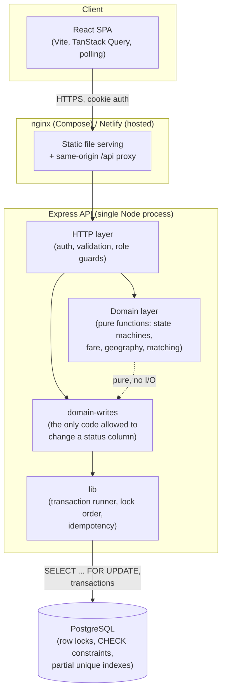
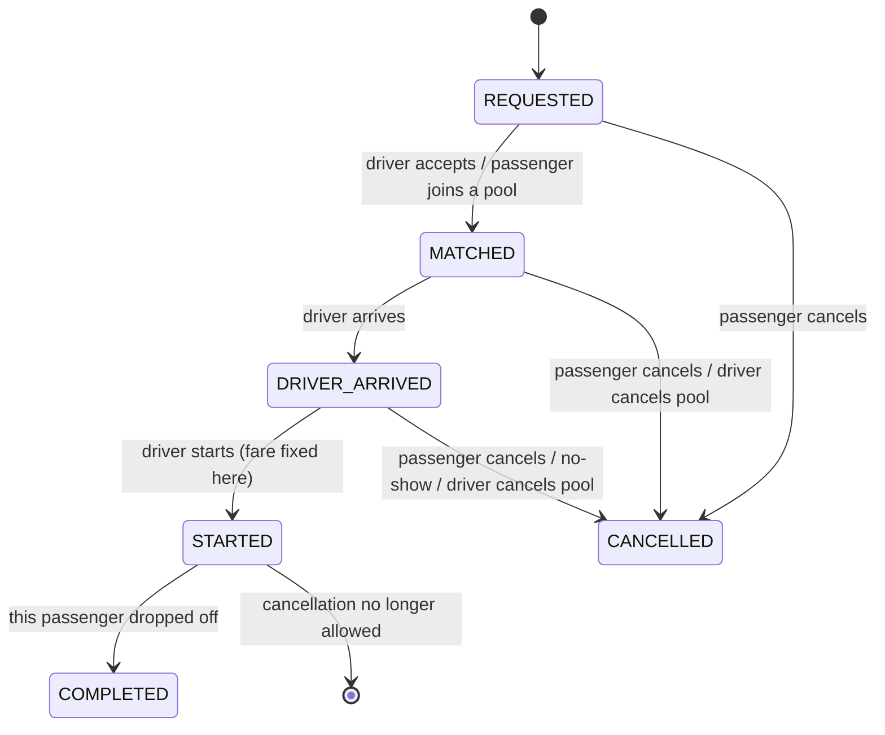
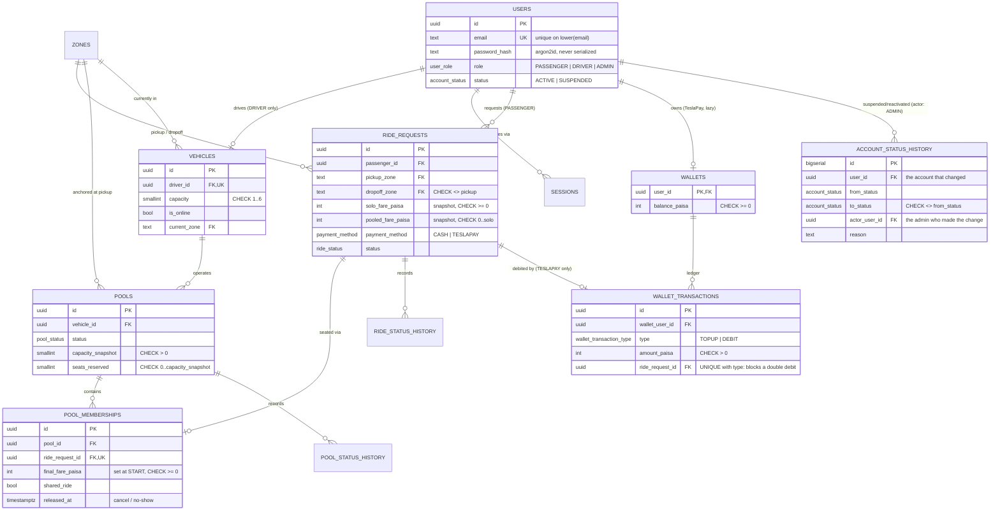

# Dhaka Tesla Pool

> Share a seat. Split the fare. Survive Dhaka traffic.

A ride-pooling MVP: passengers (Nusrat, Rafiq, Shirin) request rides, a driver (Jashim) pools compatible
requests into his three-seat Tesla (Bullet), every passenger pays an individual fare, and seat capacity
can never be exceeded — even when two people grab the last seat at the same instant.

**Demo video:** _[link — recording pending]_
**Live deployment:** [https://dhaka-tesla-pool.netlify.app](https://dhaka-tesla-pool.netlify.app)

## Table of contents

- [Problem and approach](#problem-and-approach)
- [Features implemented](#features-implemented)
- [Tech stack](#tech-stack)
- [Architecture](#architecture)
- [Database design (ERD)](#database-design-erd)
- [Project structure](#project-structure)
- [Prerequisites](#prerequisites)
- [Local setup](#local-setup)
- [Environment variables](#environment-variables)
- [Running tests](#running-tests)
- [The concurrency problem](#the-concurrency-problem)
- [API overview](#api-overview)
- [Demo credentials](#demo-credentials)
- [Deployment](#deployment)
- [Key decisions and trade-offs](#key-decisions-and-trade-offs)
- [Known limitations](#known-limitations)
- [Next improvements](#next-improvements)
- [AI usage](#ai-usage)

## Problem and approach

Dhaka's traffic makes solo rides expensive and slow. The PRD's ask: let strangers headed the same
direction share one vehicle, split the cost, and guarantee that no vehicle is ever double-booked past its
real seat count — even under concurrent load, even on a free-tier host that can go to sleep between
requests.

The approach is a modular-monolith REST API (Express + Postgres) driving a polling React frontend, built
around three ideas that show up everywhere in the codebase:

1. **One write path per aggregate.** Nothing sets `ride_requests.status`, `pools.status` or `users.status`
   except a single named-command function that checks a state-machine table first. There is no
   `PATCH { status }` anywhere.
2. **The database is the last line of defense, not the only one.** Every business rule the application
   checks has a matching `CHECK`/unique-index/FK backstop, so a bug in the application code fails loudly
   (a constraint violation) instead of silently corrupting data.
3. **Concurrency correctness is proven, not assumed.** `test/concurrency/` drives the API with real
   concurrent HTTP requests — the PRD's own "Nusrat and Shirin for the last seat" race included — and
   asserts on outcomes, not timing.

## Features implemented

- Passenger registration/login, driver accounts provisioned by seed or by an admin (no self-service driver
  onboarding — see [Known limitations](#known-limitations))
- Live fare quote (solo and pooled) before requesting a ride
- Ride request → matched into a driver's pool → arrive → start → per-passenger drop-off, with a full
  status history at every step
- **Two ways into a pool**: a driver accepts a compatible request, or a passenger joins a compatible
  *open* pool directly, both going through the identical seat-reservation code path
- Deterministic pooling rule: same pickup zone, every rider's drop-off within 3.5 km of every other
  rider's (Manhattan distance on a 10-zone grid)
- Fare fixed at trip start: pooled discount only applies once a second passenger is genuinely aboard, and
  the fare can only ever move down from the original quote, never up
- Driver dashboard: go online/offline, see nearby compatible requests, accept, manage the active pool
  (seat meter, arrive/start/drop-off/no-show/cancel), earnings history
- Passenger side: request a ride, see live status + pool card + offers list, cancel while legal, ride
  history
- **TeslaPay**: a simulated wallet with a top-up/debit ledger and a database constraint that makes double-
  debiting a single ride mathematically impossible, independent of any application-level bug
- **Admin oversight panel** (ADR-019): read-mostly — overview counts, a user directory, a ride browser
  with the same status timelines passengers and drivers see — plus exactly one write action, suspending or
  reactivating a passenger or driver account. Suspension is refused while the account has an active ride
  or pool, and revokes every existing session immediately.
- Idempotent writes everywhere a client might retry (`Idempotency-Key` header), so a double-click or a
  network retry never creates a duplicate ride, pool membership, or wallet transaction
- Proven-safe concurrent seat reservation: two riders racing for the last seat always produce exactly one
  winner and one clean rejection, never an overbooked vehicle
- Role-based authorization on every endpoint (a passenger can never read or act on another passenger's
  ride; a driver can never touch another driver's pool; only an admin reaches `/admin/*`)

## Tech stack

| Layer | Choice | Why (see the linked ADR for alternatives considered) |
|---|---|---|
| Language | TypeScript, strict, everywhere | One type system across API, web and the shared package; catches an API/frontend contract drift at compile time |
| Backend | Node 24, Express 5 | Small surface, direct control over the transaction/locking code this project's concurrency story depends on ([ADR-003](docs/decisions/ADR-003-rest-api.md)) |
| Database | PostgreSQL 17 | Row locks, `CHECK` constraints, partial unique indexes and real transactions are exactly the primitives seat-capacity correctness needs ([ADR-002](docs/decisions/ADR-002-postgresql.md)) |
| ORM | Drizzle | Typed schema and query builder without hiding the raw SQL this project needs to reason about locking explicitly ([ADR-014](docs/decisions/ADR-014-drizzle-orm.md)) |
| Auth | Argon2id password hashing, opaque server-side sessions in httpOnly cookies (not JWT) | Sessions can be revoked immediately — logout and suspension take effect on the very next request ([ADR-004](docs/decisions/ADR-004-session-authentication.md)) |
| Validation | Zod, `.strict()` schemas everywhere | Rejects unknown fields outright — the first line of defense against mass-assignment |
| Frontend | Vite + React 19 + TypeScript + React Router v7 + TanStack Query v5 + Tailwind v4 | Session-cookie-gated app with no SSR/SEO need — a router + a client-state library on top of Vite matches the deployment topology (static SPA behind nginx/Netlify) without carrying a server runtime the app doesn't use ([ADR-013](docs/decisions/ADR-013-vite-react-over-nextjs.md)) |
| Live updates | Polling with exponential backoff, not WebSockets | Works identically on a free-tier host that scales to zero between requests ([ADR-009](docs/decisions/ADR-009-polling-over-websockets.md)) |
| Testing | Vitest against a real Postgres (no mocked DB, ever) | A mocked database can't tell you a lock order is wrong ([ADR-012](docs/decisions/ADR-012-testing-strategy.md)) |
| Containers | Docker multi-stage builds, Docker Compose | Non-root runtime user, healthcheck-gated startup order |

Every non-obvious choice above has a full ADR in [`docs/decisions/`](docs/decisions/) — context, the
alternatives actually considered, and the concrete signal that would make us switch later.

## Architecture



**Layer rule, enforced by an ESLint `no-restricted-syntax` rule, not just convention:** the `domain/`
layer never imports the database or HTTP; `domain-writes/` is the *only* code allowed to write a `status`
column, and only ever with a `Locked<T>` branded type that can only be produced by a query that actually
ran `SELECT ... FOR UPDATE` — a stale, unlocked read can't be passed into a transition function by
accident. See [ADR-001](docs/decisions/ADR-001-modular-monolith.md) and [ADR-007](docs/decisions/ADR-007-state-machines.md).

### Ride and pool lifecycle



A pool's own status (`OPEN → DRIVER_ARRIVED → STARTED → COMPLETED`, or `CANCELLED` at any point before
`STARTED`) tracks the vehicle; each rider's own `ride_requests.status` tracks that specific person, since
different riders reach `COMPLETED` at different drop-off points ([ADR-016](docs/decisions/ADR-016-per-passenger-dropoff.md)).
A user's own `status` (`ACTIVE → SUSPENDED → ACTIVE`) is a third, independent state machine an admin
drives — suspension never touches a ride's or pool's own status ([ADR-019](docs/decisions/ADR-019-admin-panel-scope.md)).

## Database design (ERD)



Design notes worth defending (full reasoning in [`docs/IMPLEMENTATION_PLAN.md` §5.2](docs/IMPLEMENTATION_PLAN.md)):

- `seats_reserved` is a denormalized counter on `pools`, kept in the same transaction as membership
  changes, so one `CHECK` constraint (`seats_reserved <= capacity_snapshot`) makes overbooking impossible
  at the database level even if application code regresses.
- `capacity_snapshot` freezes a pool's capacity at creation — changing a vehicle's capacity can never
  retroactively overbook a live pool.
- Fare fields are snapshotted on the request itself, so a later change to fare constants never changes
  what a passenger was already quoted.
- Every externally visible id is a UUID — no sequential enumeration.
- All foreign keys are `ON DELETE RESTRICT`: rides — and now account status changes — are history, not
  deletable data.
- `wallet_transactions`' `UNIQUE(ride_request_id, type)` is the double-debit backstop for TeslaPay — a
  `TOPUP` row's `ride_request_id` is always `NULL`, and Postgres never treats two `NULL`s as colliding, so
  any number of top-ups is still allowed.
- `account_status_history` mirrors `ride_status_history`/`pool_status_history` exactly (same append-only
  shape, same immutability trigger) — a third instance of "one write path, one history table" rather than
  a bespoke audit log for admin actions.

## Project structure

```
dhaka-tesla-pool/
├── apps/
│   ├── api/                  Express API
│   │   ├── src/
│   │   │   ├── domain/           pure functions: state machines (ride, pool, account), fare, geography, matching
│   │   │   ├── domain-writes/    the only code allowed to change a status column
│   │   │   ├── lib/               transaction runner, lock order, idempotency, business events
│   │   │   ├── modules/          one folder per resource: auth, rides, pools, driver, wallet, admin, ...
│   │   │   ├── http/              error mapper, middleware (auth, role guard, rate limit, origin guard)
│   │   │   └── db/                schema, migrations, seed
│   │   └── test/
│   │       ├── unit/              pure-function tests, no database
│   │       ├── integration/       Supertest against a real Postgres
│   │       ├── concurrency/       real concurrent HTTP requests (the last-seat race and friends)
│   │       └── support/           test fixtures, invariant checker, naive-join control
│   └── web/                  React SPA
│       └── src/
│           ├── app/               router, layout, auth context
│           ├── features/          passenger/, driver/ and admin/ screens
│           ├── components/ui/     shared presentational components
│           └── lib/                api client, polling helper, types
├── packages/
│   └── shared/                error codes and money types shared by api and web
├── docs/
│   ├── decisions/              ADR-001 through ADR-019
│   ├── IMPLEMENTATION_PLAN.md  the full design this codebase follows
│   ├── ASSUMPTIONS.md
│   ├── LIMITATIONS.md
│   └── SCALABILITY.md
├── scripts/
│   ├── git/                    commit/branch policy enforcement (hooks + CI)
│   └── race-demo.ts             live last-seat race against a running server
├── docker-compose.yml
├── render.yaml
└── netlify.toml
```

## Prerequisites

- Node.js 24+
- Docker and Docker Compose (for the one-command path)
- Or, for running services individually: PostgreSQL 17 locally

## Local setup

### Option A — Docker Compose (recommended, matches the deployed topology)

```bash
git clone <this-repo>
cd dhaka-tesla-pool
cp .env.example .env
docker compose up --build
```

This brings up, in dependency order: `db` (Postgres, health-gated) → `migrate` (runs migrations, then
seeds the demo cast if `SEED_DEMO=true`, one-shot) → `api` (health-gated on `/api/v1/readyz`) → `web`
(nginx, health-gated on `api`). Open `http://localhost:8080`.

> **Sandbox note:** this exact command could not be executed inside the environment this project was
> built in (its outbound network blocks Docker Hub's registry). Every image, healthcheck and dependency
> gate was written and reviewed by hand, and each piece's underlying command was verified by running it
> as a separate local process against the same Postgres image tag — but this is the first thing to run
> on a machine with normal Docker Hub access. See [`docs/LIMITATIONS.md`](docs/LIMITATIONS.md).

### Option B — run services individually

```bash
npm install

# Start a local Postgres 17 however you prefer, then:
cp .env.example .env   # point DATABASE_URL at it
npm run db:migrate --workspace=apps/api
npm run db:seed --workspace=apps/api      # optional — seeds the demo cast

npm run dev --workspace=apps/api          # API on :4000
npm run dev --workspace=apps/web          # web on :5173 (proxies /api to :4000)
```

## Environment variables

See [`.env.example`](.env.example) for the full list with placeholder values — never real secrets.
Highlights:

| Variable | Purpose |
|---|---|
| `DATABASE_URL` | Postgres connection string |
| `DB_POOL_MAX` | Connection pool size (kept small — 5 by default — for free-tier Postgres, which is metered) |
| `SESSION_TTL_HOURS` | How long a login session lasts before it must be renewed |
| `COOKIE_SECURE` | `true` in production (HTTPS-only cookie), `false` for local HTTP |
| `WEB_ORIGIN` | Dev-only CORS allow-list entry; production is same-origin via proxy |
| `TRUST_PROXY` | Reverse-proxy hop count for `req.ip` — 0 locally, 1 behind the Compose nginx, 2 behind Netlify→Render |
| `SEED_DEMO` / `ALLOW_DEMO_SEED` / `DEMO_PASSWORD` | Demo cast seeding — refused in production unless explicitly allowed |

## Running tests

```bash
npm run verify   # lint + typecheck + unit + integration + concurrency, all three workspaces
```

Or individually:

```bash
npm run lint
npm run typecheck
npm run test --workspace=apps/api    # needs DATABASE_URL pointed at a real (throwaway) Postgres
npm run test --workspace=apps/web
```

The API test suite includes, by layer:

- **Unit** — pure functions only, no database: state machines (every state × command pair, matched
  against the documented transition table, for rides, pools *and* account status), fare formula,
  geography/matching, idempotency fingerprinting.
- **Integration** — Supertest against a real running app and a real (truncated-between-tests) Postgres:
  auth, ride requests, pooling (both accept and join paths), driver flow, wallet, admin (accounts, rides,
  stats), authorization boundaries, every database constraint.
- **Concurrency** — real concurrent HTTP requests, not simulated: the last-seat race (2-way and 10-way),
  a driver starting a trip while a passenger cancels, two passengers cancelling at once, a client's retry
  racing its own original request, and an admin suspending a driver while that driver accepts a ride. A
  deliberately unsafe, unlocked "naive join" is run through the same harness to prove it *would* catch a
  real bug — see [the concurrency problem](#the-concurrency-problem).

## The concurrency problem

> Bullet has 1 seat left. Nusrat and Shirin both try to claim it at nearly the same instant, and both
> initially see one seat available.

**How this codebase handles it:** both requests lock the same pool row (`SELECT ... FOR UPDATE`) inside a
short transaction. Whichever transaction's lock request Postgres grants first runs its capacity check,
reserves the seat, and commits. The second transaction was *blocked waiting for that row* — under
PostgreSQL's READ COMMITTED isolation, once it's granted the lock it re-reads the row's **just-committed**
value, so its own capacity check correctly sees zero seats left and returns `409
POOL_CAPACITY_EXCEEDED`. A `CHECK` constraint on `seats_reserved <= capacity_snapshot` makes overbooking
impossible at the database level even if that application logic were wrong.

This is proven, not just described: `test/concurrency/last-seat-race.test.ts` fires the two requests
genuinely concurrently (`Promise.all`, two real HTTP calls) and asserts exactly one 200 and one 409,
repeated 20 times, plus a 10-way variant. `test/concurrency/naive-join-control.test.ts` runs a
deliberately unsafe implementation (read the seat count, sleep, write, no lock at all) through the same
harness and confirms it *does* produce corruption — proof the harness would have caught a real bug, not
just that the real implementation happens to pass.

You can also watch it happen live against a running server:

```bash
DATABASE_URL=<same DB the running api uses> API_BASE_URL=http://localhost:4000 npm run race-demo
```

**What changes at larger scale:** row-level locking serializes contention on one pool at a time, which
scales fine as the *number* of pools grows (more drivers, more cities) but doesn't help if one specific
pool somehow attracts unusual simultaneous demand — the domain itself already prevents that (a pool stops
accepting joins the moment it's full). The full reasoning, including what breaks first at 1,000,000
passengers and 100,000 drivers, is in [`docs/SCALABILITY.md`](docs/SCALABILITY.md).

## API overview

Base path `/api/v1`. JSON only. Every response carries `X-Request-Id`. Full endpoint-by-endpoint contract
(roles, idempotency requirements, every error code) is in
[`docs/IMPLEMENTATION_PLAN.md` §12](docs/IMPLEMENTATION_PLAN.md).

| Area | Endpoints |
|---|---|
| Auth | `POST /auth/register`, `POST /auth/login`, `POST /auth/logout`, `GET /auth/me` |
| Zones & fares | `GET /zones`, `POST /fare-quotes` |
| Ride requests (passenger) | `POST /ride-requests`, `GET /ride-requests`, `GET /ride-requests/:id`, `GET /ride-requests/:id/history`, `GET /ride-requests/:id/pool-offers`, `POST /ride-requests/:id/cancel` |
| Pools (passenger) | `POST /pools/:id/join` |
| Driver | `GET /driver/status`, `POST /driver/go-online`, `POST /driver/go-offline`, `GET /driver/requests`, `POST /driver/requests/:id/accept` |
| Pools (driver) | `GET /driver/pools/active`, `GET /driver/pools`, `GET /driver/pools/:id`, `GET /driver/pools/:id/history`, `POST /driver/pools/:id/arrive`, `POST /driver/pools/:id/start`, `POST /driver/pools/:id/memberships/:mid/drop-off`, `POST /driver/pools/:id/memberships/:mid/no-show`, `POST /driver/pools/:id/cancel` |
| Wallet (TeslaPay) | `GET /wallet`, `GET /wallet/transactions`, `POST /wallet/topup` |
| Admin | `GET /admin/drivers`, `POST /admin/drivers`, `GET /admin/users`, `GET /admin/users/:id`, `POST /admin/users/:id/suspend`, `POST /admin/users/:id/reactivate`, `GET /admin/ride-requests`, `GET /admin/ride-requests/:id`, `GET /admin/stats` |
| Health | `GET /healthz` (process up), `GET /readyz` (database reachable) |

Every mutating endpoint that a client might plausibly retry requires an `Idempotency-Key` header; a
repeated key with the same body replays the original response byte-for-byte instead of repeating the
side effect. (Admin actions are the deliberate exception — see the note in the admin module — since a
retried suspend/reactivate is already safely idempotent through the account state machine itself.)

## Demo credentials

Seeded by `npm run db:seed --workspace=apps/api` (or automatically by `docker compose up`). Password for
all demo accounts is the value of `DEMO_PASSWORD` in your `.env` (`dhaka-tesla-demo` in `.env.example`).

| Role | Name | Email |
|---|---|---|
| Driver | Jashim (drives Bullet, capacity 3) | `jashim@dhakateslapool.test` |
| Passenger | Nusrat | `nusrat@dhakateslapool.test` |
| Passenger | Rafiq | `rafiq@dhakateslapool.test` |
| Passenger | Shirin | `shirin@dhakateslapool.test` |
| Admin | Admin | `admin@dhakateslapool.test` |

Wiped out the demo state experimenting? `npm run db:reset --workspace=apps/api` truncates every business
table and reseeds this exact cast from scratch — the same command a demo recording runs right before
hitting record, so every take starts from an identical, known state.

## Deployment

Design and free-tier provider decisions are in
[`docs/IMPLEMENTATION_PLAN.md` §18.3](docs/IMPLEMENTATION_PLAN.md) and codified in
[`render.yaml`](render.yaml) / [`netlify.toml`](netlify.toml): Render (API, Docker runtime, Singapore) +
Neon (Postgres, same region) + Netlify (static SPA, proxying `/api/*` to Render).

**Status:** deployed and live.

- Frontend: [https://dhaka-tesla-pool.netlify.app](https://dhaka-tesla-pool.netlify.app)
- API: [https://dhaka-tesla-pool-api-luvr.onrender.com](https://dhaka-tesla-pool-api-luvr.onrender.com)
  (`-luvr` because the plain `dhaka-tesla-pool-api` hostname was already taken on Render)
- Database: Neon (Postgres 17, `ap-southeast-1`)

The Render free web service spins down after ~15 minutes idle and takes 30-50s to wake on the next
request — expected, and the frontend's cold-start handling (`isColdStart`, ADR-009) already covers it.
An external health-check ping keeps it warm during the evaluation window regardless. See
[Demo credentials](#demo-credentials) to log in on the live deployment.

## Key decisions and trade-offs

Every non-obvious engineering choice has a full ADR — context, the alternatives actually considered, why
it fits this specific product, and the concrete signal that would change the decision later:

| # | Decision |
|---|---|
| [001](docs/decisions/ADR-001-modular-monolith.md) | Modular monolith, not microservices |
| [002](docs/decisions/ADR-002-postgresql.md) | PostgreSQL over other databases |
| [003](docs/decisions/ADR-003-rest-api.md) | REST over GraphQL |
| [004](docs/decisions/ADR-004-session-authentication.md) | Opaque server-side sessions over JWT |
| [005](docs/decisions/ADR-005-money-integer-paisa.md) | Money as integer paisa, never floats |
| [006](docs/decisions/ADR-006-concurrency-pessimistic-locking.md) | Pessimistic row locking over optimistic versioning or SERIALIZABLE |
| [007](docs/decisions/ADR-007-state-machines.md) | Centralized, table-driven state machines |
| [008](docs/decisions/ADR-008-zone-grid-geography-matching.md) | A 10-zone grid instead of real mapping |
| [009](docs/decisions/ADR-009-polling-over-websockets.md) | Polling with backoff over WebSockets |
| [010](docs/decisions/ADR-010-transactional-idempotency-keys.md) | Idempotency keys claimed inside the business transaction |
| [011](docs/decisions/ADR-011-git-workflow.md) | Branch model and enforced git policy |
| [012](docs/decisions/ADR-012-testing-strategy.md) | Real Postgres in every test, never a mocked database |
| [013](docs/decisions/ADR-013-vite-react-over-nextjs.md) | Vite + React Router over Next.js |
| [014](docs/decisions/ADR-014-drizzle-orm.md) | Drizzle over a heavier ORM |
| [015](docs/decisions/ADR-015-fare-finalized-at-trip-start.md) | Fare snapshotted at request, finalized at trip start |
| [016](docs/decisions/ADR-016-per-passenger-dropoff.md) | Per-passenger drop-off, not a pool-level completion |
| [017](docs/decisions/ADR-017-frontend-redesign-light-theme.md) | Light, warm theme over the earlier dark redesign |
| [018](docs/decisions/ADR-018-frontend-map-real-basemap.md) | A real basemap with zone pins, never a faked live-GPS route |
| [019](docs/decisions/ADR-019-admin-panel-scope.md) | Admin: read-mostly oversight plus exactly one write action (suspend/reactivate) |

The full list of assumptions made to resolve every PRD ambiguity — with the reasoning and what would
change if the assumption changed — is in [`docs/ASSUMPTIONS.md`](docs/ASSUMPTIONS.md).

## Known limitations

Full list with reasoning in [`docs/LIMITATIONS.md`](docs/LIMITATIONS.md). Headline items: no automatic
expiry of un-matched ride requests, no Playwright end-to-end test, no driver self-service onboarding
(drivers are provisioned by seed or by an admin), the admin panel can suspend/reactivate an account but
cannot force-cancel a ride or pool underneath it (ADR-019 — a deliberate boundary, not an oversight), rate
limiting only on the auth endpoints, no refund path for a TeslaPay debit.

## Next improvements

In rough priority order, if this moved past MVP:

1. Push updates (Server-Sent Events) in place of polling — the single highest-leverage change for real
   scale, deliberately deferred because it needs a long-lived process a free-tier host can't cheaply
   provide (see [`docs/SCALABILITY.md`](docs/SCALABILITY.md)).
2. Automatic expiry of stale `REQUESTED` rides.
3. A Playwright end-to-end test covering the full passenger+driver+admin happy path against a real running
   stack.
4. Driver self-service onboarding with a review/KYC state, instead of seed/admin-only provisioning.
5. Let an admin force-cancel the ride or pool blocking a suspension, instead of refusing and waiting — the
   deliberately deferred alternative in ADR-019, once suspensions are frequent enough to make the wait a
   real operational cost.

## AI usage

This project was built with Claude (Anthropic) across two phases: an initial planning phase that produced
[`docs/IMPLEMENTATION_PLAN.md`](docs/IMPLEMENTATION_PLAN.md) from the PRD, then an implementation phase
(Claude Code) that built the plan session by session, one feature branch per session, each opened as a
pull request and reviewed before merging. `docs/AI_USAGE_LOG.md` is a running log of specific suggestions
across the project and how they were judged, in the author's own words — kept separate from this section
because that judgment call is the point of the exercise, not something to summarize away.

A few concrete, specific instances from the implementation phase (each pull request's own description has
more — every PR includes an "AI usage on this branch" section with what was accepted as proposed,
modified, or rejected outright, and why):

- **Accepted as proposed:** the visual direction for the frontend (one accent color, no gradients or fake
  analytics, a plain status stepper) — agreed before any code was written, then implemented as specified.
- **Decided directly, not delegated:** two later product-direction calls — light theme over the initial
  dark "Electric Night" redesign, and a real basemap with zone pins over anything that implied live GPS —
  were put to me explicitly as options with trade-offs, and I picked and gave the reason (see
  [ADR-017](docs/decisions/ADR-017-frontend-redesign-light-theme.md) and
  [ADR-018](docs/decisions/ADR-018-frontend-map-real-basemap.md) for the reasoning as recorded).
- **Modified:** a concurrency test originally planned around a literal "pause a transaction mid-flight
  with a test hook," per one reading of the plan's own wording. Building it revealed that the real
  mechanism — an idempotency key claim's own unique-index `INSERT` blocking a concurrent duplicate — is
  already exercised correctly by firing two genuinely concurrent real HTTP requests (`Promise.all`), which
  is a more honest proof than a synthetic pause would have been. Kept the concurrent-HTTP version,
  dropped the planned test hook entirely.
- **Rejected:** a proposal to retrofit the invariant checker into a global `afterEach` across every
  existing integration test file, to more literally match the plan's "runs after every integration test"
  wording. Scoped out as disproportionate risk (touching ~30 already-passing test files) for marginal
  benefit beyond what the dedicated concurrency tests already assert directly.
- **Rejected:** letting the admin panel force-cancel a ride or pool to unblock a suspension immediately.
  It would have added an admin actor to the ride/pool state machines and their concurrency tests — the
  most heavily graded code in the project — for an operator convenience an MVP doesn't need yet. Refusing
  and explaining why (ADR-019) kept that code untouched.
