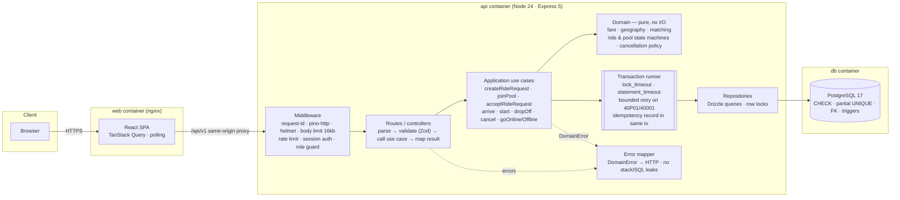
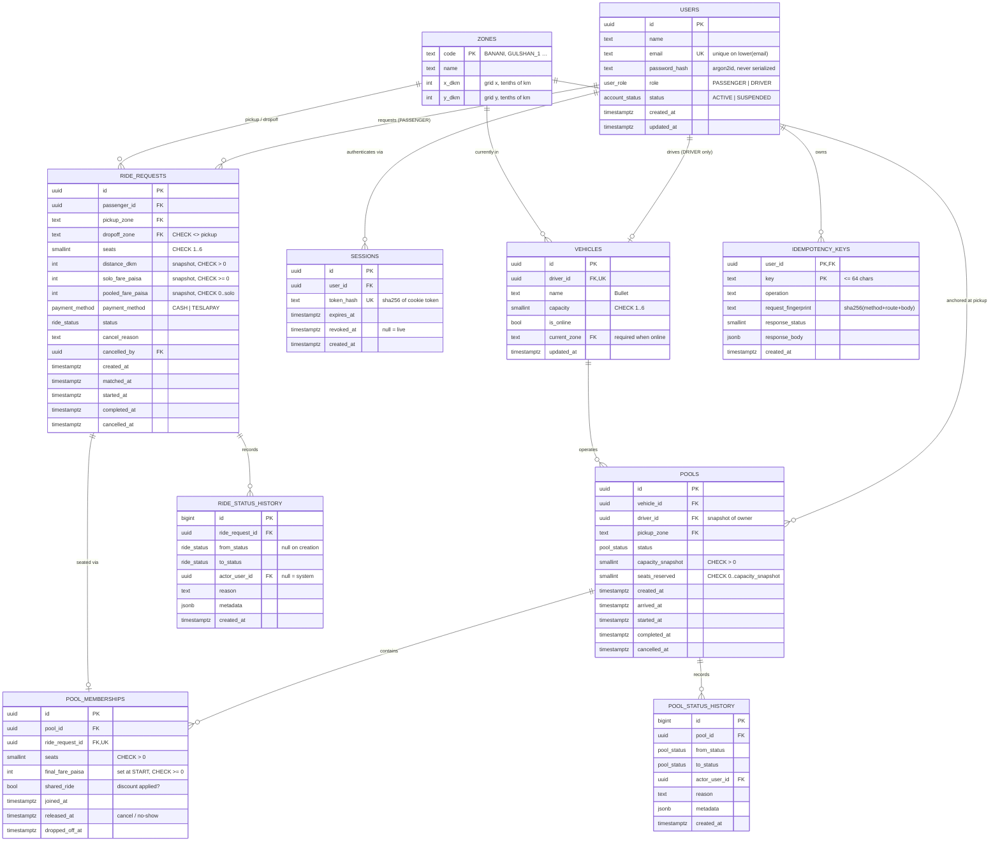
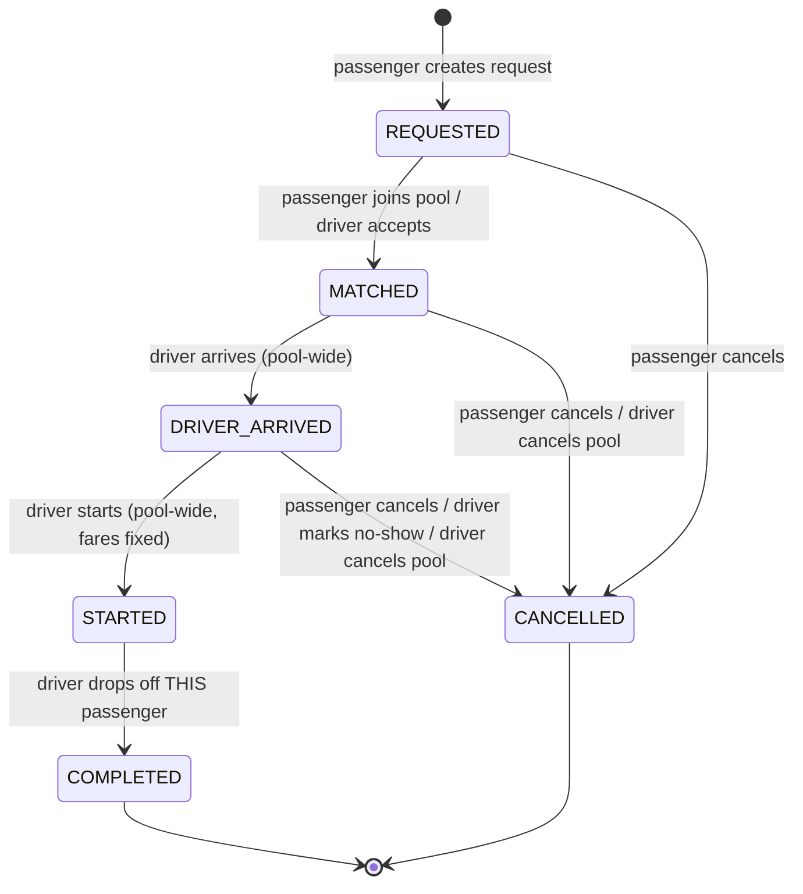
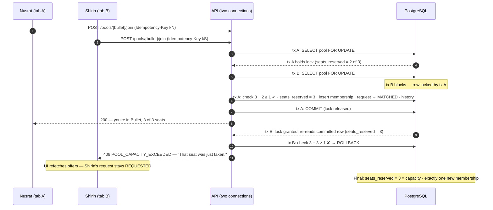

# Dhaka Tesla Pool — Implementation Plan

> *Share a seat. Split the fare. Survive Dhaka traffic.*
>
> Status: **Phase 0 output, revision 2** — written before any application code. Revision 2 adds the
> polling/retry policy (§15.4), transition-atomicity rules (§10.7) and a free-tier deployment plan
> verified against provider documentation in September 2026 (§18.3). This document is the contract the
> implementation is held to. When the implementation diverges, this file (and the matching ADR) is
> updated in the same commit.

---

## 0. Phase 0 — Inspection findings

### 0.1 What exists

| Item | Finding | Consequence |
|---|---|---|
| Repository | None provided. Only `Dhaka_Tesla_Pool_PRD_Internship.docx`. | Greenfield plan. First commit on `master` is this plan + a README skeleton; every line of code lands through a `feature/*` branch. |
| PRD | 19 sections, one embedded image (a pedal/battery rickshaw branded "TESLA"). | The "Tesla" is a **three-seat battery rickshaw**. Capacity 3 is the canonical demo value. |
| Cast | Jashim (driver), Bullet (3-seat Tesla), Nusrat, Rafiq, Shirin (passengers). | Used verbatim in seed, tests, README and video. Tests that need a *second* driver introduce exactly one extra, documented character (Monir, Tesla "Toofan") — never `user1/driver1`. |
| Scoring note | PRD §15: "120 features with a broken process can score lower than a small, clean MVP." | Process (branches, commits, docs, tests) is treated as a first-class deliverable, not an afterthought. |

### 0.2 Explicit requirements (condensed from PRD §3–§14)

Passenger: sign up/in · request ride (pickup, destination, seats) · estimated fare · status tracking
(waiting → matched → in progress → completed/cancelled) · history · cancel while valid.
Driver: sign in · online/offline · own a Tesla with fixed capacity · see relevant requests · accept ·
mark arrival/start/complete · see passengers/seats · ride history.
Pool: multiple requests share one Tesla · occupied seats never exceed capacity · individual fares ·
clear lifecycle and pool membership.
Platform: React/Next.js, Node.js, relational DB (justified), Docker Compose, `.env.example`,
migrations, seed with the cast, health checks, free-tier deployment (or reproducible Docker),
architecture diagram + ERD, meaningful tests incl. concurrency, README with AI usage, 6-minute video,
`master` / `pre-release` / `release/v1.0.0` + `feature/*` branches, conventional commits.

### 0.3 Ambiguities → resolved by assumption (full register in §22)

The PRD deliberately leaves these open. Each gets one decision, applied consistently:
matching rule · when a fare becomes final · who may register as a driver · how many active rides a
passenger may hold · whether pools accept joiners after arrival · what "complete" means for a pool
with two drop-offs · what happens to passengers when a driver cancels · whether co-riders see each
other's names · where the driver "is" (no GPS).

### 0.4 Conflicts between the engineering brief and the PRD — resolved in favour of the PRD

| Brief suggested | PRD says | Resolution |
|---|---|---|
| "If choosing Next.js, use it deliberately" | Next.js *recommended*, plain React + router *fine* | **Vite + React + React Router** (ADR-013). Every screen is authenticated and interactive; SSR/SEO buy nothing; one fewer server runtime. Allowed explicitly by PRD §6. |
| JWT strategy | "auth … justified in README" | **Opaque server-side sessions in Postgres** behind an httpOnly cookie (ADR-004). Real logout/revocation without a denylist. |
| `audit_events` table | "hold onto enough history to explain exactly what happened" | Two **append-only status-history tables** (ride + pool) enforced immutable by trigger; security events go to structured logs. No generic audit table without a consumer. |
| Lifecycle ends in pool-level `COMPLETED` | "improve it if you can explain why" | **Per-passenger drop-off** (ADR-016): Nusrat is dropped at Mohakhali before Rafiq reaches Gulshan 1; her ride must not stay "in progress" for another 2 km. |
| `GET /pools/available` | — | `GET /ride-requests/:id/pool-offers` — an offer only makes sense relative to *a specific request* (pickup, destinations, seats). |

---

## 1. Scope and priorities

Priority order from the brief, applied to every trade-off:
**Correctness > data integrity > security > architecture > edge cases > tests > UX reliability > docs > polish.**

| Tier | Contents |
|---|---|
| **P0 — must ship** | Everything in §0.2. Transaction-safe pooling with row locks + DB CHECK backstop. Centralised state machines. Idempotent critical mutations. Ownership authorization. Status history. Concurrency tests C1–C16 (§10.6). Docker Compose from clean clone. ADRs, ERD, diagrams, assumptions, limitations, scalability doc. |
| **P1 — should ship** | Driver "no-show" removal at arrival. GitHub Actions CI. `scripts/race-demo.ts` (last-seat race on demand for the video). Public deployment. One Playwright E2E happy path. |
| **P2 — could ship** | Simulated **TeslaPay** wallet with ledger (Cash is always available). Automatic expiry of stale `REQUESTED` rides. |
| **Won't (documented in LIMITATIONS)** | Real maps/routing/GPS, real payment gateway, WebSockets, Redis, queues, microservices, admin panel, driver onboarding/KYC, ratings, push notifications. |

**Cut line:** if time runs short, cut P2, then Playwright, then deployment (fallback: reproducible Docker, as the PRD allows). **Never cut** concurrency tests, authorization tests, or the docs the PRD requires.

---

## 2. Technology decisions (summary — each has an ADR)

| Concern | Choice | Realistic alternatives | Why it fits a ride-pooling MVP | Switch when |
|---|---|---|---|---|
| Language | TypeScript (strict) everywhere | JS | Enums for states/error codes shared web↔api; compile-time safety on money types | — |
| Repo shape | npm workspaces monorepo: `apps/api`, `apps/web`, `packages/shared` | Two repos | One PR/commit can change contract + both sides; shared Zod schemas & error codes | Teams split ownership |
| Backend | **Express 5** | NestJS, Fastify | Small surface, explicit middleware order (request-id → logger → limits → auth → validate → handler → error mapper) that can be explained line by line; team already fluent in Express | Module count/DI needs grow (→ NestJS) or throughput-bound (→ Fastify) |
| Database | **PostgreSQL 17** | MySQL, SQLite | Row locks (`SELECT … FOR UPDATE`), CHECK constraints, partial unique indexes, triggers, `timestamptz` — the capacity problem is a relational-integrity problem | Geospatial matching at scale → add PostGIS, not a new DB |
| Data access | **Drizzle ORM** + drizzle-kit SQL migrations | Prisma, Knex, Kysely | Typed schema **and** first-class `.for('update')`, CHECK and partial-index declarations; generated migrations are plain reviewable SQL. Prisma has no row-lock query API (raw SQL needed on the most important path) | Complex reporting → add Kysely/raw SQL for read models |
| Validation | **Zod** (shared package), `.strict()` objects | Joi, class-validator | One schema used by the form and the API; `.strict()` rejects unknown keys → mass-assignment defence | — |
| Auth | Opaque session token (32 random bytes), SHA-256 hashed in `sessions`, httpOnly cookie | JWT access+refresh | Real revocation on logout/suspension, no token in JS reach (XSS), trivial to explain. Cost: one indexed lookup per request | Multi-region/very high RPS → cache session lookups or short-lived JWT + revocation list |
| Password hashing | **Argon2id** (`@node-rs/argon2`, prebuilt binaries) | bcrypt | Memory-hard, OWASP-recommended; prebuilt → no native build pain in Docker | — |
| Logging | **pino** + pino-http | winston | Structured JSON, fast, built-in redaction | Ship to a log backend unchanged |
| Rate limiting | express-rate-limit (in-memory store) | Redis store, edge limits | Correct for one instance; honest limitation documented | >1 API instance → Redis store / edge |
| Frontend | **Vite + React + React Router + TanStack Query** | Next.js App Router | Authenticated SPA; server state is the source of truth → TanStack Query gives caching, polling, retries, invalidation after conflicts | Public/SEO pages appear → Next.js |
| Styling | Tailwind CSS | CSS Modules | Consistent spacing/tokens fast for a solo builder, no runtime | — |
| Real-time | **Polling** (3–5 s, paused when tab hidden) | WebSocket, SSE | Status changes are human-paced; polling has no connection lifecycle, no out-of-order problem, survives proxies/free tiers | Driver fleet in thousands → SSE/WebSocket gateway (§SCALABILITY) |
| Tests | **Vitest** + Supertest against **real Postgres**; RTL; Playwright (P1) | Jest, pg-mem, SQLite | Concurrency tests are meaningless on an in-memory fake — locks must be real | — |
| Hosting | Render free web service (API, Docker) + Neon free Postgres + Netlify static site with `/api/*` proxy rewrite (§18.3) | Render Postgres (free DB expires after 30 days), Koyeb, Fly (no free tier) | All three free without a card; proxy rewrite keeps the session cookie first-party | Real users → paid Render instance (no spin-down); fallback = reproducible Compose |

---

## 3. Requirements traceability

PRD requirement → decision → implementation location → test → documentation.

| # | PRD requirement | Decision | Location (planned) | Test | Doc |
|---|---|---|---|---|---|
| R1 | Passenger sign up / sign in | Public registration creates **passengers only**; server sessions | `api/src/modules/auth` | `auth.int.test.ts` | ADR-004, A3 |
| R2 | Request ride: pickup, destination, seats | Zod schema; zones are FK'd reference data; one active ride per passenger | `api/src/modules/rides/create-ride-request.ts` | `ride-requests.int`, `schemas.unit` | §12 |
| R3 | Estimated fare | Pure fare engine; solo + pooled estimates snapshotted on the request | `api/src/domain/fare.ts` | `fare.unit` | ADR-005, §8 |
| R4 | Track status | Request state machine; polling | `api/src/domain/ride-state-machine.ts`, `web/src/features/passenger` | `ride-state-machine.unit`, `lifecycle.int` | ADR-007, §9 |
| R5 | Ride history | Keyset-paginated list + per-ride status timeline | `api/src/modules/rides` | `ride-requests.int` (pagination) | §12 |
| R6 | Cancel while valid | Cancellation policy + lock protocol | `api/src/domain/cancellation-policy.ts`, `modules/rides/cancel-ride-request.ts` | `cancellation.unit`, C4, C10 | §9.3 |
| R7 | Driver sign in | Shared auth; drivers provisioned by seed | `modules/auth`, `db/seed` | `auth.int` | A3 |
| R8 | Online / offline | Vehicle availability + current zone; vehicle row lock | `modules/driver/availability.ts` | `driver.int`, C6 | ADR-006 |
| R9 | Tesla with fixed capacity | `vehicles.capacity` CHECK; pool `capacity_snapshot` | `db/schema.ts`, migration | `db-constraints.int`, C11 | ERD |
| R10 | See relevant requests | Driver's current zone + compatibility with open pool | `modules/driver/list-relevant-requests.ts` | `driver.int` | §7 |
| R11 | Accept a ride/pool | Accept creates or extends the driver's single open pool | `modules/pools/accept-ride-request.ts` | C3, C5 | §10 |
| R12 | Arrive / start / complete | Pool state machine; per-passenger drop-off | `domain/pool-state-machine.ts`, `modules/pools/*` | `lifecycle.int`, C7, C8 | ADR-016 |
| R13 | Driver sees passengers/seats + history | Driver pool view with members, seat meter, earnings | `modules/driver` | `driver.int` | §12 |
| R14 | Multiple requests share one Tesla | `pools` + `pool_memberships` | `modules/pools/join-pool.ts` | `pooling.int` | ERD |
| R15 | Occupied seats ≤ capacity | Row lock + domain check + DB CHECK (3 layers) | `modules/pools/seat-reservation.ts`, migration | C1, `db-constraints.int`, invariant checker | ADR-006, §10 |
| R16 | Individual fare per passenger | `pool_memberships.final_fare_paisa`, fixed at START | `modules/pools/start-pool.ts` | `fare.unit`, `lifecycle.int` | ADR-015 |
| R17 | Clear lifecycle, obvious membership | Append-only history; UI stepper + seat meter | `ride_status_history`, `pool_status_history` | `lifecycle.int` | §9 |
| R18 | Simple geography, documented matching rule | Zone grid + Manhattan distance; same pickup + drop-off spread ≤ 3.5 km | `domain/geography.ts`, `domain/matching.ts` | `matching.unit` | ADR-008, §7 |
| R19 | Hand-testable fare, money storage explained | Integer **paisa**, basis-point discount | `domain/fare.ts` | `fare.unit` (Nusrat ৳54, Rafiq ৳60) | ADR-005 |
| R20 | Cash or simulated TeslaPay | `payment_method` on request; wallet is P2 | `modules/payments` (P2) | `wallet.int` (P2) | A20 |
| R21 | Relational DB, justified | PostgreSQL | — | — | ADR-002 |
| R22 | Docker Compose, `.env.example`, migrations, seed, health checks | db → migrate (one-shot) → api → web, all health-gated | `docker-compose.yml`, `apps/*/Dockerfile` | CI compose smoke test | README |
| R23 | Free-tier deployment | Render + Neon + static host | `render.yaml`, `netlify.toml` | Manual smoke checklist | README |
| R24 | Architecture diagram + ERD | Mermaid, in repo | `docs/diagrams/*.md` | — | README |
| R25 | Tests: capacity, transitions, pooled fares, ownership, cancellation, concurrency | See §16 | `apps/api/test/**` | — | README "Testing" |
| R26 | Concurrency handling now + at scale | Pessimistic row lock; scale path documented | — | C1–C16 | ADR-006, `SCALABILITY.md` |
| R27 | README sections | Checklist §23 | `README.md` | — | — |
| R28 | AI usage disclosure | Running log kept during development | `docs/AI_USAGE_LOG.md` → README | — | README |
| R29 | Branches + conventional commits | §19 | Git | — | ADR-011 |
| R30 | 6-minute video | Scripted to PRD §13 timings | `docs/DEMO_SCRIPT.md` | Rehearsal | README link |
| R31 | Consistent cast | Seed, tests, README, video | `db/seed`, `test/fixtures` | — | README |
| R32 | Justify every non-mandated choice | ADRs 001–016 | `docs/decisions/` | — | README links |

---

## 4. Architecture

### 4.1 Shape: modular monolith

One API process, one database, one static frontend. Modules are separated by folder and by a strict
dependency direction, not by network hops. Rationale and revisit conditions: ADR-001.



### 4.2 Layer rules (enforced by review + an ESLint `no-restricted-imports` rule)

| Layer | May import | Must not |
|---|---|---|
| `domain/` | nothing outside `domain/` and `packages/shared` | touch DB, HTTP, env, clock (time is passed in) |
| `modules/*/use-cases` | domain, repositories, transaction runner | read `req`/`res`, format HTTP |
| `modules/*/routes` | use cases, schemas, auth guards | contain business rules or SQL |
| `repositories` | Drizzle, schema | make business decisions |

The domain being pure is what makes the fare, matching and transition matrices unit-testable in
milliseconds and explainable in the interview without a running system.

### 4.3 Planned project structure

```
dhaka-tesla-pool/
├─ apps/
│  ├─ api/
│  │  ├─ src/
│  │  │  ├─ config/            env schema (Zod), fail-fast loader
│  │  │  ├─ db/                client, schema.ts, migrations/, seed/ (cast + race scenario)
│  │  │  ├─ domain/            fare.ts geography.ts matching.ts ride-state-machine.ts
│  │  │  │                     pool-state-machine.ts cancellation-policy.ts money.ts errors.ts
│  │  │  ├─ modules/
│  │  │  │  ├─ auth/           routes, session service, password service, repository
│  │  │  │  ├─ zones/          GET /zones
│  │  │  │  ├─ fares/          POST /fare-quotes
│  │  │  │  ├─ rides/          passenger ride requests, history, cancel, pool offers
│  │  │  │  ├─ pools/          accept, join, arrive, start, drop-off, no-show, cancel, seat-reservation
│  │  │  │  ├─ driver/         availability, relevant requests, driver views
│  │  │  │  └─ health/
│  │  │  ├─ http/              middleware/, error-mapper.ts, response.ts, pagination.ts
│  │  │  ├─ lib/               logger.ts, transaction.ts, idempotency.ts, lock-order.ts
│  │  │  ├─ app.ts             builds the Express app (no listen) → testable
│  │  │  └─ server.ts          listen + graceful shutdown
│  │  └─ test/                 unit/ integration/ concurrency/ support/ (fixtures, invariant checker)
│  └─ web/
│     └─ src/
│        ├─ app/               router, providers, layouts (passenger / driver guards)
│        ├─ features/          auth/ passenger/ driver/ rides/ pools/
│        ├─ components/ui/     StatusStepper, SeatMeter, FareBreakdown, Timeline, ErrorBanner …
│        └─ lib/               api-client.ts (error-code aware), money.ts, idempotency-key.ts
├─ packages/shared/src/        zones.ts enums.ts schemas.ts error-codes.ts
├─ scripts/race-demo.ts        fires Nusrat & Shirin at the last seat, prints outcome
├─ docs/                       this plan, ADRs, diagrams, ASSUMPTIONS, LIMITATIONS, SCALABILITY,
│                              DEMO_SCRIPT, AI_USAGE_LOG
├─ docker-compose.yml  .env.example  .gitattributes (eol=lf)  .github/workflows/ci.yml
```

---

## 5. Domain model

### 5.1 Glossary and ownership

| Concept | Meaning | Owned by |
|---|---|---|
| **User** | Account with exactly one role: `PASSENGER` or `DRIVER` | itself |
| **Vehicle** ("Tesla") | Bullet; fixed capacity; online/offline + current zone | one driver (1:1 in MVP) |
| **RideRequest** | One passenger's journey: pickup, drop-off, seats, fare estimates, status | the passenger |
| **Pool** | One shared trip of one vehicle from one pickup zone | the vehicle's driver (snapshotted `driver_id`) |
| **PoolMembership** | "This request rides in this pool with N seats and this final fare" | the pool (seat accounting), linked 1:1 to a request |
| **StatusHistory** | Append-only transitions for requests and pools | system (immutable) |
| **Zone** | Reference data: Dhaka area on a km grid | system (migration-seeded) |
| **IdempotencyKey** | Stored outcome of a keyed mutation | the calling user |

Key relationships: a request belongs to **at most one** pool ever (`UNIQUE(ride_request_id)`); a
vehicle has **at most one active** pool (partial unique index); a passenger has **at most one active**
request (partial unique index).

### 5.2 ERD



Design notes worth defending:

- **`seats_reserved` is a denormalised counter** on `pools`, maintained in the same transaction as
  membership changes. It exists so that a *single-row* CHECK constraint (`seats_reserved <=
  capacity_snapshot`) can make overbooking impossible at the database level, even if application code
  regresses. Drift risk is covered by the invariant checker (§16.4): `seats_reserved = SUM(seats) of
  unreleased memberships`.
- **`capacity_snapshot`** — a pool keeps the capacity it was created with; changing Bullet's capacity
  can never retroactively overbook a live pool (C11). The API exposes no capacity mutation at all.
- **`driver_id` on pools** is a snapshot for ownership checks and history, independent of later vehicle
  reassignment.
- **Fare snapshots on the request** mean a later change to fare constants never changes what Nusrat was
  quoted.
- **UUIDs** (`gen_random_uuid()`) for every externally visible id → no sequential enumeration.
- All FKs are `ON DELETE RESTRICT`: rides are history, not deletable data.
- Enums are Postgres enum types (`ALTER TYPE … ADD VALUE` covers future additions).

### 5.3 Indexes (each tied to a real query)

| Index | Serves |
|---|---|
| `users` unique `(lower(email))` | login, duplicate-registration check |
| `sessions` unique `(token_hash)` | every authenticated request |
| `vehicles` unique `(driver_id)` | "my vehicle", 1:1 ownership |
| `ride_requests` partial unique `(passenger_id) WHERE status IN (REQUESTED, MATCHED, DRIVER_ARRIVED, STARTED)` | one active ride per passenger; double-submit defence |
| `ride_requests (passenger_id, created_at DESC, id DESC)` | passenger history, keyset pagination |
| `ride_requests (pickup_zone, created_at) WHERE status = 'REQUESTED'` | driver's relevant requests |
| `pools` partial unique `(vehicle_id) WHERE status IN (OPEN, DRIVER_ARRIVED, STARTED)` | one active pool per Tesla; C3 backstop |
| `pools (pickup_zone) WHERE status = 'OPEN'` | pool offers for a request |
| `pools (driver_id, created_at DESC, id DESC)` | driver history |
| `pool_memberships` unique `(ride_request_id)` | a request is seated at most once, ever |
| `pool_memberships (pool_id) WHERE released_at IS NULL` | active members of a pool |
| `ride_status_history (ride_request_id, created_at, id)` | ride timeline |
| `pool_status_history (pool_id, created_at, id)` | pool timeline |
| `idempotency_keys` PK `(user_id, key)`; `(created_at)` | replay lookup; retention cleanup |

---

## 6. Database invariants

"Both" = enforced by the database *and* checked by the application (the app check produces a precise
error code; the DB constraint is the backstop that holds even if the app is wrong).

| ID | Invariant | Enforced by | Test |
|---|---|---|---|
| I1 | Vehicle capacity 1..6 | DB CHECK | `db-constraints.int` |
| I2 | Requested seats 1..6 (DB, physical) and 1..3 (app, product policy) | Both | `schemas.unit`, `db-constraints.int` |
| I3 | `0 <= seats_reserved <= capacity_snapshot` | **DB CHECK** + app check under row lock | C1, `db-constraints.int` |
| I4 | `seats_reserved = Σ seats of unreleased memberships` | App (same tx) | invariant checker after every integration test |
| I5 | Pickup ≠ drop-off | Both | `schemas.unit`, `db-constraints.int` |
| I6 | Fares ≥ 0 and `pooled_fare <= solo_fare` | DB CHECK | `fare.unit`, `db-constraints.int` |
| I7 | Money is integer paisa end-to-end | Types (`int`, branded `Paisa` type) | `fare.unit` |
| I8 | ≤ 1 active ride per passenger | DB partial unique | C2b |
| I9 | ≤ 1 active pool per vehicle | DB partial unique | C3, C5 |
| I10 | A request is seated in ≤ 1 pool | DB unique | C2, C5 |
| I11 | Only legal transitions | App state machines (single module) | matrix unit tests, C7, C8, C14 |
| I12 | Terminal states (COMPLETED, CANCELLED) never change | App state machine + invariant checker | `lifecycle.int` |
| I13 | History rows are never updated or deleted | **DB trigger** raising on UPDATE/DELETE | `db-constraints.int` |
| I14 | Latest history `to_status` = current status | App (same tx) | invariant checker |
| I15 | A driver only operates their own vehicle/pool | App ownership checks in every pool use case | `authorization.int` |
| I16 | Membership pickup zone = pool pickup zone; all destinations pairwise ≤ 3.5 km | App (matching) | `matching.unit`, `pooling.int` |
| I17 | Online vehicle has a current zone | DB CHECK `(NOT is_online) OR current_zone IS NOT NULL` | `db-constraints.int` |
| I18 | Timestamps are `timestamptz`, set by the server (`now()` in tx) | Schema + app | — |

---

## 7. Geography and matching

### 7.1 "Dhaka on graph paper"

Each zone is a point on a km grid (x = east, y = north, origin Banani), stored in **tenths of a km**
(`dkm`) so every distance is an integer. Distance is **Manhattan** (`|Δx| + |Δy|`) — a crude but
honest model of grid streets, and computable by hand in the interview. Coordinates are approximate and
documented as such; nobody should mistake this for routing.

| Zone code | Name | x (km) | y (km) |
|---|---|---|---|
| BANANI | Banani | 0.0 | 0.0 |
| GULSHAN_1 | Gulshan 1 | 1.5 | −1.5 |
| GULSHAN_2 | Gulshan 2 | 1.5 | 0.5 |
| MOHAKHALI | Mohakhali | −0.5 | −2.0 |
| TEJGAON | Tejgaon | 0.0 | −3.5 |
| FARMGATE | Farmgate | −2.0 | −4.5 |
| DHANMONDI | Dhanmondi | −3.0 | −7.0 |
| MIRPUR | Mirpur | −5.0 | 0.0 |
| UTTARA | Uttara | 0.5 | 9.0 |
| BASHUNDHARA | Bashundhara | 4.0 | 1.5 |

Distances the demo relies on:

| From → To | Calculation | km |
|---|---|---|
| Banani → Mohakhali (Nusrat) | 0.5 + 2.0 | **2.5** |
| Banani → Gulshan 1 (Rafiq) | 1.5 + 1.5 | **3.0** |
| Banani → Gulshan 2 (Shirin) | 1.5 + 0.5 | **2.0** |
| Mohakhali ↔ Gulshan 1 | 2.0 + 0.5 | 2.5 |
| Gulshan 1 ↔ Gulshan 2 | 0.0 + 2.0 | 2.0 |
| Mohakhali ↔ Gulshan 2 | 2.0 + 2.5 | 4.5 |

### 7.2 Matching rule (deterministic, one function: `domain/matching.ts`)

A request **R** may join an open pool **P** iff, checked in this order (order fixes which error the
loser of a race sees):

1. `P.status = OPEN` → else `POOL_NOT_ACCEPTING`
2. `R.status = REQUESTED` → else `REQUEST_NOT_OPEN`
3. `P.capacity_snapshot − P.seats_reserved >= R.seats` → else `POOL_CAPACITY_EXCEEDED`
4. `R.pickup_zone = P.pickup_zone` → else `POOL_INCOMPATIBLE`
5. for every unreleased member M: `distance(R.dropoff, M.dropoff) <= 3.5 km` → else `POOL_INCOMPATIBLE`

`MAX_DROPOFF_SPREAD_DKM = 35` (inclusive). Why this rule: same pickup means one arrival event serves
everyone (the pool's `DRIVER_ARRIVED` is meaningful); bounded drop-off spread keeps the detour small
without routing. Nusrat (Mohakhali) and Rafiq (Gulshan 1): spread 2.5 km → **compatible**. Shirin
(Gulshan 2) with Nusrat: 4.5 km → incompatible; with Rafiq alone: 2.0 km → compatible.

Drop-off order shown to the driver: ascending distance from pickup (ties by zone code) — informational.
The function signature takes plain values, so replacing it with a real routing/detour model later
changes one module.

---

## 8. Fare model

### 8.1 Formula (all integers, BDT paisa; ৳1 = 100 paisa)

```
BASE_FARE_PAISA        = 3000   (৳30)
PER_DKM_PAISA          = 150    (৳15 per km)
POOL_DISCOUNT_BPS      = 2000   (20%)

seatFare     = BASE_FARE_PAISA + PER_DKM_PAISA × distance_dkm
soloFare     = seatFare × seats
poolDiscount = floor(soloFare × POOL_DISCOUNT_BPS / 10000)
pooledFare   = soloFare − poolDiscount
```

Rounding: only the discount can be fractional; it is floored to whole paisa (the passenger is never
charged more than `soloFare`; any sub-paisa goes against the discount). With the current constants
every fare is a multiple of ৳0.30, so rounding never triggers — the rule exists for when constants
change, and is unit-tested with non-default constants.

### 8.2 When the fare becomes final (ADR-015)

- At **request creation** the server computes and stores `solo_fare_paisa` and `pooled_fare_paisa`.
  The client's numbers are never read. The UI shows: *"৳67.50 — drops to ৳54.00 if someone shares
  your Tesla."*
- At **START**, under the pool lock, each unreleased membership gets
  `final_fare = pooled_fare` if the pool has **≥ 2 unreleased bookings**, else `solo_fare`, and
  `shared_ride` is recorded. From then on it is immutable.
- Consequences: the fare can only ever go **down** from the quote; the first passenger isn't punished for
  being first; a co-rider cancelling before start correctly removes the discount; nothing can change it
  after start (cancellation is illegal after START).

### 8.3 Worked examples (these are the unit-test fixtures)

| Passenger | Trip | dkm | seatFare | Solo | Discount | Pooled |
|---|---|---|---|---|---|---|
| Nusrat | Banani → Mohakhali, 1 seat | 25 | 3000 + 3750 = 6750 | **৳67.50** | 1350 | **৳54.00** |
| Rafiq | Banani → Gulshan 1, 1 seat | 30 | 3000 + 4500 = 7500 | **৳75.00** | 1500 | **৳60.00** |
| Shirin | Banani → Gulshan 2, 1 seat | 20 | 3000 + 3000 = 6000 | ৳60.00 | 1200 | ৳48.00 |
| Rafiq (race scenario) | Banani → Gulshan 1, 2 seats | 30 | 7500 | ৳150.00 | 3000 | ৳120.00 |

Main demo: Nusrat + Rafiq share Bullet → Nusrat pays **৳54**, Rafiq **৳60**, Jashim's trip total ৳114.
If Rafiq cancels before start, Nusrat rides alone and pays ৳67.50.
Payment: `CASH` (default; driver collects `final_fare` at drop-off) or `TESLAPAY` (P2, §8.4).

### 8.4 TeslaPay (P2 — only if P0/P1 are done)

`wallets(user_id PK, balance_paisa CHECK >= 0)` + `wallet_transactions(… UNIQUE(ride_request_id, type))`.
Request creation with TESLAPAY requires `balance >= solo_fare` (the ceiling). Debit of `final_fare`
happens inside the drop-off transaction (wallet row locked); the unique constraint makes a double debit
impossible. Simulated top-up capped at ৳2,000 per call.

---

## 9. State machines (ADR-007, ADR-016)

There is **no** `PATCH { status }` anywhere. Every transition is a named command
(`accept`, `join`, `arrive`, `start`, `dropOff`, `markNoShow`, `cancel`, `cancelPool`) that goes through
`domain/ride-state-machine.ts` / `domain/pool-state-machine.ts`. Each command checks, in order:
**actor role → ownership → current state → transition legal → preconditions**. The transition tables
below are *data* in code; the unit tests iterate over every (state × command) pair, so the doc table
and the code cannot silently disagree.

### 9.1 Ride request lifecycle (what each passenger sees)



PRD labels → states: *waiting* = REQUESTED · *matched* = MATCHED, DRIVER_ARRIVED · *in progress* =
STARTED · *completed* / *cancelled*.

| Current \ Command | seat (join / accept) | arrive* | start* | dropOff | cancel (passenger) | markNoShow (driver) | cancelPool* (driver) |
|---|---|---|---|---|---|---|---|
| REQUESTED | ✅ → MATCHED | — | — | — | ✅ → CANCELLED | — | — |
| MATCHED | ❌ REQUEST_NOT_OPEN | ✅ → DRIVER_ARRIVED | ❌ | ❌ | ✅ → CANCELLED | ❌ | ✅ → CANCELLED |
| DRIVER_ARRIVED | ❌ | ❌ | ✅ → STARTED | ❌ | ✅ → CANCELLED | ✅ → CANCELLED | ✅ → CANCELLED |
| STARTED | ❌ | ❌ | ❌ | ✅ → COMPLETED | ❌ CANCELLATION_NOT_ALLOWED | ❌ | ❌ |
| COMPLETED | ❌ | ❌ | ❌ | ❌ | ❌ | ❌ | ❌ |
| CANCELLED | ❌ | ❌ | ❌ | ❌ | ❌ | ❌ | ❌ |

\* cascaded from the pool command to every unreleased member, in the same transaction, one history row
per request. ❌ = `409 INVALID_TRANSITION` (details: `currentStatus`, `command`) unless a more specific
code is listed; "—" = not reachable (request not in a pool).

### 9.2 Pool lifecycle (what Jashim operates)

| Current \ Command | seat | arrive | start | dropOff (member) | member leaves (cancel / no-show) | cancelPool |
|---|---|---|---|---|---|---|
| *(none)* | accept creates → **OPEN** | | | | | |
| OPEN | ✅ | ✅ → DRIVER_ARRIVED (needs ≥ 1 member) | ❌ | ❌ | ✅ seats released; if 0 members left → CANCELLED (`EMPTY`) | ✅ → CANCELLED |
| DRIVER_ARRIVED | ❌ POOL_NOT_ACCEPTING | ❌ | ✅ → STARTED (needs ≥ 1 member; fixes fares) | ❌ | ✅ same as above | ✅ → CANCELLED |
| STARTED | ❌ | ❌ | ❌ | ✅ member COMPLETED; last one → pool **COMPLETED** | ❌ | ❌ |
| COMPLETED / CANCELLED | ❌ | ❌ | ❌ | ❌ | ❌ | ❌ |

### 9.3 Policies behind the tables (all in ASSUMPTIONS)

- Joins only while **OPEN**: arrival closes boarding, so the seat count can't change while Jashim is
  loading passengers.
- Passenger may cancel until STARTED, no fee in MVP. After START: rejected, because the fare is fixed and
  the passenger is physically in the vehicle.
- Driver may remove a **no-show** only after arriving (P1) — otherwise one missing passenger would force
  cancelling everyone.
- Driver cancelling a pool cancels its requests (reason `DRIVER_CANCELLED`); passengers re-request.
  Re-queueing them is a documented future improvement.
- An empty pool (all members left before start) auto-cancels so it doesn't hold the vehicle's
  single-active-pool slot.

---

## 10. Concurrency model (ADR-006)

### 10.1 Strategy

**Pessimistic row locks inside short READ COMMITTED transactions**, plus database constraints as a
backstop, plus idempotency for retries.

- *Why not optimistic versioning?* Contention is exactly on the hot row (the last seat); optimistic
  retries would make every loser retry just to fail again. A lock makes losers wait milliseconds and then
  read the truth.
- *Why not only an atomic conditional `UPDATE … SET seats_reserved = seats_reserved + n WHERE
  seats_reserved + n <= capacity`?* It solves capacity alone, but joining also has to validate pool
  status and compatibility against **current members** and insert a membership consistently. Locking the
  pool row makes that whole multi-step decision one serialized critical section that's easy to reason
  about. (Recorded as the considered alternative in ADR-006.)
- *Why not SERIALIZABLE?* It would be correct but moves the problem to "retry anything, anywhere";
  explicit locks make the critical section visible in code and in the interview.

### 10.2 Global lock order (prevents deadlock cycles)

```
idempotency_keys row  →  vehicles row  →  pools row  →  ride_requests rows (ascending id)
```

Every use case acquires a **prefix-respecting subsequence** of this order. The helper `lib/lock-order.ts`
exposes `lockVehicle`, `lockPool`, `lockRequests(ids)` and asserts (in dev/test) that they are called in
order. Where a use case can only discover the pool *after* reading the request (passenger cancel), it
reads without a lock, locks in order, re-verifies, and restarts (max 3) if the membership moved.

### 10.3 Transaction runner (`lib/transaction.ts`)

- `SET LOCAL lock_timeout = '3s'`, `SET LOCAL statement_timeout = '5s'`.
- Retries **only** `40P01` (deadlock) and `40001` (serialization) — max 3 attempts, 20–100 ms jittered
  backoff. Never retries business errors, constraint violations or timeouts.
- `55P03` (lock timeout) / `57014` (statement timeout) → `503 SERVICE_BUSY` + `Retry-After: 1`.
- Constraint violations that escape the app checks are mapped, not leaked: `23514` on
  `pools_seats_within_capacity` → `409 POOL_CAPACITY_EXCEEDED`; `23505` on the active-ride index →
  `409 ACTIVE_RIDE_EXISTS`; etc.
- No network I/O inside a transaction. Logging of business events happens **after** commit.

### 10.4 Transaction scripts

**joinPool(passenger, poolId, rideRequestId, idemKey)** — the PRD's critical path
```
BEGIN
  claim idempotency key (§11)                         -- replay if already committed
  SELECT … FROM pools WHERE id = $pool FOR UPDATE     -- serialize all seat changes on this pool
  SELECT … FROM ride_requests WHERE id = $req FOR UPDATE
  assert request.passenger_id = caller                -- else 404 (no existence leak)
  load unreleased members of pool                     -- consistent: we hold the pool lock
  matching.canJoin(pool, request, members)            -- order: status, request status, capacity, compatibility
  UPDATE pools SET seats_reserved = seats_reserved + $seats   -- DB CHECK is the backstop
  INSERT pool_memberships (…)                         -- UNIQUE(ride_request_id) is a second backstop
  UPDATE ride_requests SET status = MATCHED, matched_at = now()
  INSERT ride_status_history (REQUESTED → MATCHED, actor = passenger)
  store idempotency response
COMMIT
emit log event pool.seat_reserved
```

**acceptRideRequest(driver, rideRequestId, idemKey)**
```
BEGIN
  claim idempotency key
  SELECT vehicle WHERE driver_id = caller FOR UPDATE  -- serializes with go-offline (C6)
  assert vehicle.is_online                            -- else DRIVER_OFFLINE
  SELECT active pool of vehicle FOR UPDATE
    none  → INSERT pool (OPEN, capacity_snapshot = vehicle.capacity, pickup = request.pickup)
             (partial unique index backstops a concurrent second create — C3)
    OPEN  → use it
    else  → POOL_NOT_ACCEPTING
  SELECT ride_request FOR UPDATE                      -- second driver waits here (C5)
  assert request.pickup_zone = vehicle.current_zone   -- else ZONE_MISMATCH
  … same seat reservation as joinPool …
COMMIT
```

**cancelRideRequest(passenger, rideRequestId, idemKey)**
```
read membership (no lock) → poolId?
BEGIN
  claim idempotency key
  if poolId: lock pool
  lock request; if its membership ≠ poolId read earlier → ROLLBACK, restart (≤3)
  cancellationPolicy.assertCancellable(request.status)   -- STARTED → CANCELLATION_NOT_ALLOWED
  if member: set released_at, pools.seats_reserved -= seats
             if pool has 0 unreleased members → pool CANCELLED (EMPTY) + history
  request → CANCELLED (+ reason, cancelled_by) + history
COMMIT
```

**arrive / start / cancelPool(driver, poolId)** — lock pool → assert `pool.driver_id = caller` → lock
unreleased members' requests ordered by id → state-machine check → update pool + cascade to each request
(+ history rows). `start` additionally fixes each membership's `final_fare` and `shared_ride`.

**dropOff(driver, poolId, membershipId)** — lock pool → lock that request → pool STARTED and member not
yet dropped → request COMPLETED, `dropped_off_at` → if no undropped members remain, pool COMPLETED.

**goOffline(driver)** — lock vehicle → reject with `DRIVER_HAS_ACTIVE_POOL` if one exists → offline.
**goOnline(driver, zone)** — lock vehicle → online + `current_zone`.

### 10.5 The PRD race: Nusrat and Shirin, one seat left

Setup (`seed --scenario=last-seat`): Bullet (capacity 3) has an OPEN pool with Rafiq (2 seats,
Gulshan 1). Nusrat (Mohakhali) and Shirin (Gulshan 2) each hold a REQUESTED 1-seat request; both are
compatible with Rafiq, both see "1 seat left".



Under READ COMMITTED, a row blocked on `FOR UPDATE` is re-read after the lock holder commits, so tx B
decides on the committed value — this is the property the whole design leans on (PostgreSQL docs,
"Explicit Locking" and "Transaction Isolation").

### 10.6 Concurrency matrix

| ID | Scenario | Mechanism | Expected outcome | Test (`test/concurrency/…`) |
|---|---|---|---|---|
| C1 | Two passengers, one seat | Pool row lock + DB CHECK | Exactly one 200, one 409 `POOL_CAPACITY_EXCEEDED`; seats = capacity | `last-seat-race` (+ 10-way variant, 20 iterations) |
| C2 | Same passenger double-clicks create/join (same key) | Idempotency key in same tx | One request/membership; both responses identical, second has `Idempotent-Replayed: true` | `double-submit` |
| C2b | Double submit without key | Partial unique index (one active ride) | One 201, one 409 `ACTIVE_RIDE_EXISTS` (details carry existing id) | `double-submit-no-key` |
| C3 | Driver accepts twice concurrently | Vehicle lock + request status + unique active pool | One membership; second 409 `REQUEST_NOT_OPEN` (or replay with key) | `driver-double-accept` |
| C4 | Driver starts while passenger cancels | Both lock the pool first | Either: cancel wins → start proceeds without her (or `POOL_EMPTY`); or start wins → cancel 409 `CANCELLATION_NOT_ALLOWED`. Never both. | `start-vs-cancel` (50 iterations, outcome ∈ allowed set, invariants hold) |
| C5 | Two drivers accept the same request | Request row lock; loser re-reads MATCHED | One assignment; loser 409 `REQUEST_NOT_OPEN`, loser's freshly created pool rolled back | `two-drivers-accept` (uses Monir/Toofan fixture) |
| C6 | Driver goes offline while requests pending/being accepted | Vehicle row lock | Accept after offline → 409 `DRIVER_OFFLINE`; offline with active pool → 409 `DRIVER_HAS_ACTIVE_POOL` | `offline-vs-accept` |
| C7 | Start before arrival | State machine | 409 `INVALID_TRANSITION` | `lifecycle.int` |
| C8 | Complete (drop-off) before start | State machine | 409 `INVALID_TRANSITION` | `lifecycle.int` |
| C9 | Passenger cancels after start | Cancellation policy | 409 `CANCELLATION_NOT_ALLOWED` | `lifecycle.int` |
| C10 | Two passengers cancel simultaneously | Pool lock serializes | Both cancelled; seats_reserved decremented exactly twice; empty pool auto-cancels once | `double-cancel` |
| C11 | Capacity change during active pool | No API mutation; `capacity_snapshot` | Live pool unaffected | `db-constraints.int` + design |
| C12 | Client timeout while tx commits, client retries | Retry's key INSERT blocks on the unique index until tx 1 finishes, then replays | One booking, replayed response | `retry-during-commit` (retry fired while tx 1 is held open by a test hook) |
| C13 | Timeout after success, retry | Key replay; without key → natural-key conflict resolves to current state | No duplicate | `retry-after-success` |
| C14 | Stale client sends an old transition | State machine against locked, current row | 409 `INVALID_TRANSITION` with `currentStatus`; UI refetches | `stale-transition` |
| C15 | DB failure midway | Single tx; failure injected via dependency injection after membership insert | No membership, seats unchanged, request REQUESTED, no history row | `mid-transaction-failure` |
| C16 | Process dies after accept, before commit | Postgres rolls back on connection loss | Nothing persisted; lock released; a second accept succeeds | `connection-killed` (terminates the backend with `pg_terminate_backend`) |

### 10.7 Transition atomicity: status, lock and history can never drift apart

"Remember to write history in the same transaction" is not a strategy; it fails the first time someone
adds a code path in a hurry. The design makes the wrong thing impossible to express:

| Rule | How it is enforced |
|---|---|
| **One write path per aggregate.** `applyRideTransition(tx, lockedRequest, command, actor, reason?)` and `applyPoolTransition(tx, lockedPool, …)` are the *only* functions that change a `status` column. Each one: asks the state machine → updates status + lifecycle timestamp → inserts the history row → returns the new row. | Repositories expose no `updateStatus`/generic `update` for these tables; an ESLint `no-restricted-syntax` rule flags `.set({ status` outside `domain-writes/`. |
| **Transaction required by type.** The functions take a `Tx` (Drizzle transaction handle), never the global `db`. | Calling outside a transaction is a compile error. |
| **Only locked rows go in.** The argument type is `Locked<RideRequest>`, a branded type returned only by `lockRequests()` / `lockPool()`. | A stale, unlocked read can't be passed in by accident. |
| **`from_status` comes from the locked row**, never from the client or an earlier read. | History always records the transition that actually happened. |
| **Conditional update as a guard.** `UPDATE … SET status = $to WHERE id = $id AND status = $from`, and assert exactly one row changed; otherwise throw `INVALID_TRANSITION`. | Redundant under the lock by design — it turns any future lock mistake into a clean 409 instead of silent corruption. |
| **Cascades stay inside the pool command's transaction.** Pool `arrive`/`start`/`cancel` lock the pool, then member requests in ascending id, then call `applyRideTransition` for each. | One commit: either every member moves with the pool or none does. |
| **Timestamps are transaction time.** `now()` in Postgres is the transaction start, so a cascade's history rows share one timestamp; timeline ordering uses `(created_at, id)`. | Consistent, explainable timelines. |
| **Side effects after commit.** Business log events are emitted after `COMMIT` returns. | No "logged but rolled back" events. |
| **Verified continuously.** Invariant I14 (latest history `to_status` = current status) runs after every integration and concurrency test. | Drift shows up as a failing test, not a support ticket. |

Considered alternative (recorded in ADR-007): a Postgres trigger that writes history automatically on
every status change, with the actor passed via `SET LOCAL app.actor_id`. It makes forgetting impossible,
but moves business behaviour into the database where it is harder to read, test in isolation and explain.
Rejected for the MVP; the single write path above plus I14 gives the same guarantee in visible code.

---

## 11. Idempotency (ADR-010)

| Aspect | Decision |
|---|---|
| Endpoints (key **required**) | `POST /ride-requests`, `POST /pools/:id/join`, `POST /driver/requests/:id/accept`, `POST /ride-requests/:id/cancel` |
| Endpoints (key **optional**) | driver pool commands (arrive/start/drop-off/no-show/cancel) — already naturally guarded by the state machine |
| Header | `Idempotency-Key: <uuid>` (≤ 64 chars, validated) |
| Scope | `(user_id, key)` — two users can never collide; operation name stored |
| Fingerprint | SHA-256 of `method + route template + canonical JSON body` |
| Storage | `idempotency_keys` row written **inside the business transaction** |
| Same key, same fingerprint, committed | Replay stored status + body, header `Idempotent-Replayed: true` |
| Same key, different fingerprint | `422 IDEMPOTENCY_KEY_REUSED` |
| Same key, first request still in flight | The second `INSERT … ON CONFLICT DO NOTHING` blocks on the unique index until the first commits (→ replay) or rolls back (→ executes normally). No `IN_PROGRESS` state to get stuck. |
| First attempt failed with a business error (4xx) | Tx rolled back → key not stored → retry re-evaluates against current truth (e.g. the seat may be free again) |
| First attempt 5xx | Same as above — nothing half-stored |
| Retention | 24 h; expired rows ignored and deleted by an hourly in-process sweep |
| Client | Key generated per *intent* (`crypto.randomUUID()`), reused across retries of that intent, discarded after a definitive response or when the form changes |

Defence in depth: even if a client loses the key (page reload mid-request), the natural-key constraints
(one active ride per passenger, one membership per request) still prevent duplicates, and the error
details carry the id of the existing ride so the UI can navigate to it.

---

## 12. API contract plan (ADR-003: REST)

### 12.1 Conventions

- Base path `/api/v1`. JSON only; mutations require `Content-Type: application/json` (else 415).
- Success: `{ "data": … }`. Lists: `{ "data": [...], "page": { "limit": 20, "nextCursor": "…" | null } }`.
- Error: `{ "error": { "code": "POOL_CAPACITY_EXCEEDED", "message": "…", "requestId": "…", "details": { … } } }`.
- Money: integer `…Paisa` fields only; formatting is the client's job.
- Time: ISO-8601 UTC strings; the UI renders Asia/Dhaka.
- Pagination: keyset cursor over `(created_at, id)`, opaque base64url. `limit` default 20, max 50
  (larger → 400, not silently clamped).
- Every response carries `X-Request-Id`.
- Non-owners get **404, not 403**, for another user's resource (no existence oracle). Wrong role → 403.

### 12.2 Endpoints

| Method & path | Role | Idem-Key | Body → Success | Notable errors |
|---|---|---|---|---|
| `POST /auth/register` | anon | – | `{name, email, password}` → 201 user (role always PASSENGER) | 400, 409 EMAIL_TAKEN, 429 |
| `POST /auth/login` | anon | – | `{email, password}` → 200 user + session cookie | 401 INVALID_CREDENTIALS, 429 |
| `POST /auth/logout` | any | – | → 204, session revoked | 401 |
| `GET /auth/me` | any | – | → user (+ vehicle for drivers) | 401 |
| `GET /zones` | public | – | → zones | – |
| `POST /fare-quotes` | passenger | – | `{pickupZone, dropoffZone, seats}` → `{distanceDkm, soloFarePaisa, pooledFarePaisa, breakdown}` | 400 |
| `POST /ride-requests` | passenger | **req** | `{pickupZone, dropoffZone, seats, paymentMethod}` → 201 request | 400, 409 ACTIVE_RIDE_EXISTS, 422 |
| `GET /ride-requests` | passenger | – | `?status&cursor&limit` → own requests | 400 |
| `GET /ride-requests/:id` | owner | – | → request + pool summary (vehicle, driver first name, seats, `sharedWithCount`) + fare | 404 |
| `GET /ride-requests/:id/history` | owner | – | → status timeline | 404 |
| `GET /ride-requests/:id/pool-offers` | owner | – | → compatible OPEN pools: vehicle, driver first name, seats left, your fares | 404, 409 REQUEST_NOT_OPEN |
| `POST /ride-requests/:id/cancel` | owner | **req** | `{reason?}` → request | 404, 409 CANCELLATION_NOT_ALLOWED |
| `POST /pools/:id/join` | passenger | **req** | `{rideRequestId}` → request (MATCHED) + pool summary | 404, 409 POOL_CAPACITY_EXCEEDED / POOL_NOT_ACCEPTING / POOL_INCOMPATIBLE / REQUEST_NOT_OPEN |
| `GET /driver/status` | driver | – | → vehicle, online, zone, active pool id | 403 |
| `POST /driver/go-online` | driver | – | `{zone}` → status | 400 |
| `POST /driver/go-offline` | driver | – | → status | 409 DRIVER_HAS_ACTIVE_POOL |
| `GET /driver/requests` | driver | – | → REQUESTED rides in current zone, compatible with open pool if any | 409 DRIVER_OFFLINE |
| `POST /driver/requests/:id/accept` | driver | **req** | → pool with members | 404, 409 DRIVER_OFFLINE / ZONE_MISMATCH / REQUEST_NOT_OPEN / POOL_CAPACITY_EXCEEDED |
| `GET /driver/pools/active` | driver | – | → pool, members (name, pickup, drop-off, seats, fare), seat meter | – |
| `GET /driver/pools` | driver | – | `?cursor&limit` → history with earnings | – |
| `GET /driver/pools/:id` · `/history` | pool owner | – | → pool / timeline | 404 |
| `POST /driver/pools/:id/arrive` | pool owner | opt | → pool | 409 INVALID_TRANSITION / POOL_EMPTY |
| `POST /driver/pools/:id/start` | pool owner | opt | → pool with final fares | 409 INVALID_TRANSITION / POOL_EMPTY |
| `POST /driver/pools/:id/memberships/:mid/drop-off` | pool owner | opt | → pool | 404, 409 INVALID_TRANSITION |
| `POST /driver/pools/:id/memberships/:mid/no-show` | pool owner | opt | → pool | 409 INVALID_TRANSITION |
| `POST /driver/pools/:id/cancel` | pool owner | opt | `{reason}` → pool | 409 INVALID_TRANSITION |
| `GET /healthz` | public | – | liveness, no DB | – |
| `GET /readyz` | public | – | DB `SELECT 1` (1 s timeout) | 503 |

### 12.3 Error catalog (`packages/shared/src/error-codes.ts`)

| Code | HTTP | User-facing message (web) |
|---|---|---|
| VALIDATION_FAILED | 400 | Field-level messages from `details.fields` |
| MALFORMED_JSON · IDEMPOTENCY_KEY_REQUIRED | 400 | "Something went wrong sending that. Please retry." |
| UNAUTHENTICATED | 401 | Redirect to sign-in, keep return path |
| INVALID_CREDENTIALS | 401 | "Email or password is incorrect." |
| FORBIDDEN | 403 | "This area is for drivers/passengers only." |
| NOT_FOUND | 404 | "We couldn't find that ride." |
| PAYLOAD_TOO_LARGE | 413 | — |
| UNSUPPORTED_MEDIA_TYPE | 415 | — |
| EMAIL_TAKEN | 409 | "That email already has an account." |
| ACTIVE_RIDE_EXISTS | 409 | "You already have a ride in progress." + link |
| REQUEST_NOT_OPEN | 409 | "This ride was already matched or cancelled." + refresh |
| POOL_CAPACITY_EXCEEDED | 409 | "That seat was just taken. Here are the current options." + refetch offers |
| POOL_NOT_ACCEPTING | 409 | "This Tesla is no longer taking passengers." |
| POOL_INCOMPATIBLE | 409 | "This Tesla's route no longer suits your trip." |
| INVALID_TRANSITION | 409 | "The ride has moved on — refreshing." + refetch |
| CANCELLATION_NOT_ALLOWED | 409 | "Your ride has already started and can't be cancelled." |
| POOL_EMPTY | 409 | "No passengers on board." |
| DRIVER_OFFLINE · DRIVER_HAS_ACTIVE_POOL · ZONE_MISMATCH | 409 | Driver-specific guidance |
| IDEMPOTENCY_KEY_REUSED | 422 | Generic retry message (indicates a client bug; logged) |
| RATE_LIMITED | 429 | "Too many attempts. Try again in N seconds." (`Retry-After`) |
| SERVICE_BUSY | 503 | "Busy right now — retrying…" (auto-retry once) |
| SERVICE_UNAVAILABLE | 503 | "We can't reach the server. Retry." |
| INTERNAL_ERROR | 500 | "Unexpected error. Reference: {requestId}" |

---

## 13. Security model

### 13.1 Threat model (lightweight STRIDE-ish, mapped to OWASP API Top 10 2023)

| Threat | Actor | OWASP | Mitigation | Test |
|---|---|---|---|---|
| Read/cancel another passenger's ride | malicious passenger | API1 BOLA | Every query scoped by `passenger_id = caller`; 404 for non-owners; UUIDs | `authorization.int` |
| Operate another driver's pool | malicious driver | API1 | `pool.driver_id = caller` check after lock | `authorization.int` |
| Passenger calls driver commands | malicious passenger | API5 BFLA | Role guard per router; role read from DB session, never from client | `authorization.int` |
| Self-register as driver / set status / set fare | any | API3 BOPLA (mass assignment) | Registration is passenger-only; `.strict()` Zod schemas; explicit column allow-lists in repositories | `authorization.int`, `schemas.unit` |
| Credential stuffing / brute force | attacker | API2 | 5 attempts / 15 min per (IP, email) + 30 / 15 min per IP; Argon2id; generic error; dummy hash verify on unknown email (timing) | `auth.int` |
| Session theft via XSS | attacker | API2 | httpOnly cookie; strict CSP on web; React escaping; no `dangerouslySetInnerHTML` | review, header test |
| CSRF | attacker site | – | `SameSite=Lax` cookie + JSON-only mutations + `Origin` allow-list check on state-changing requests | `auth.int` |
| Token reuse after logout / suspended user | attacker | API2 | Server-side revocation; session lookup checks `revoked_at`, `expires_at`, `users.status` | `auth.int` |
| Resource exhaustion | attacker | API4 | 16 kb body limit; bounded strings/enums; `limit ≤ 50`; per-route rate limits; statement timeout | `limits.int` |
| Duplicate booking / capacity abuse | concurrent client | API6 (business flows) | Locks, constraints, idempotency, one active ride per passenger | C1–C3 |
| Injection | attacker | – | Parameterized queries only (Drizzle); zone codes are FK'd enums | `limits.int` (payload corpus) |
| Information leakage | any | API8 misconfig | Error mapper hides stacks/SQL; `password_hash` never selected by default repository methods; pino redaction; `x-powered-by` off; helmet | `errors.int` |
| Co-rider privacy | curious passenger | – | Passengers see `sharedWithCount` only — no names; drivers see first name + zones + seats only | `authorization.int` |

### 13.2 Authorization matrix

| Resource / action | Anonymous | Passenger (owner) | Passenger (other) | Driver (owner) | Driver (other) |
|---|---|---|---|---|---|
| register / login | ✅ | – | – | – | – |
| zones | ✅ | ✅ | ✅ | ✅ | ✅ |
| fare quote, create ride request | 401 | ✅ | ✅ | 403 | 403 |
| read / history / offers / cancel ride request | 401 | ✅ | 404 | 403 | 403 |
| join pool (with own request) | 401 | ✅ | 404 (request not theirs) | 403 | 403 |
| go online/offline, relevant requests, accept | 401 | 403 | 403 | ✅ | ✅ (own vehicle only) |
| read / arrive / start / drop-off / no-show / cancel pool | 401 | 403 | 403 | ✅ | 404 |
| health | ✅ | ✅ | ✅ | ✅ | ✅ |

### 13.3 Auth and platform hardening details

- Session cookie `dtp_session`: httpOnly, `Secure` in production, `SameSite=Lax`, `Path=/`, 7-day
  absolute expiry; token = 32 random bytes (base64url), only its SHA-256 is stored.
- Password: 8–128 chars (upper bound prevents hashing DoS), Argon2id default parameters.
- Registration reveals `EMAIL_TAKEN` — a conscious usability trade-off, mitigated by rate limiting;
  documented in ASSUMPTIONS.
- `trust proxy` is an explicit hop count from `TRUST_PROXY`: 1 locally (nginx), 2 in the hosted setup
  (Netlify proxy → Render load balancer → app). Wrong value = every user shares one rate-limit bucket
  (or clients can spoof `X-Forwarded-For`). Verified in the deployment smoke test by logging `req.ip`.
- Every API response sends `Cache-Control: no-store` and ETags are disabled for `/api`: a CDN proxy that
  honours HTTP caching must never cache one user's ride and serve it to another (see §18.3).
- CORS off in production (same-origin via proxy); dev allow-list from `WEB_ORIGIN`.
- Secrets only via environment; `.env` git-ignored; `.env.example` has placeholders; config is validated
  with Zod at boot and the process exits with a readable message on invalid config.
- Seeding demo users is refused when `NODE_ENV=production` unless `ALLOW_DEMO_SEED=true`.

---

## 14. Observability and failure handling

| Concern | Plan |
|---|---|
| Request id | Accept incoming `X-Request-Id` if it's a UUID, else generate; echo in header and error body; bound into every log line via pino child logger |
| Access log | method, route template, status, duration ms, user id, role — never bodies |
| Business events | `ride.requested`, `pool.created`, `pool.seat_reserved`, `pool.capacity_conflict`, `pool.arrived`, `pool.started`, `ride.dropped_off`, `ride.cancelled`, `auth.login_failed` — emitted after commit |
| Redaction | `req.headers.cookie`, `authorization`, `*.password`, `*.token` |
| Health | `/healthz` (process up), `/readyz` (DB reachable) — Compose and the host use `/readyz` |
| Shutdown | SIGTERM → stop accepting → drain in-flight (10 s) → close pg pool |
| DB down | Connection errors → 503 `SERVICE_UNAVAILABLE`; `/readyz` 503; web shows retry banner |
| Validation | 400 with `details.fields` |
| Conflict | 409 with a specific code |
| Unexpected | 500 + requestId; full error logged server-side only |

Reconstructing "what happened to Nusrat's 8:41 ride": `ride_status_history` (who, what, when, why) +
logs filtered by the request ids in that history's metadata.

---

## 15. Frontend plan

### 15.1 Structure and data rules

- Server state lives **only** in TanStack Query; no client-side copy of status, seats or fares that could
  go stale silently. The server is authoritative; the UI shows server responses.
- Polling: active ride 3 s, driver requests/active pool 4 s, paused when the tab is hidden, refetch on
  window focus.
- After any 409, invalidate the affected queries and show the mapped message — never retry a business
  conflict automatically.
- Every mutation button: disabled + spinner while pending; idempotency key held for the intent; one
  retry affordance on network error using the **same** key.
- Route guards by role are UX only; the API enforces.
- Polling and retry follow §15.4 exactly — one shared helper, not per-screen improvisation.

### 15.2 Routes and screens

| Route | Screen | Key elements |
|---|---|---|
| `/login`, `/register` | Auth | Field errors, rate-limit countdown |
| `/p` | Passenger home | Active ride card *or* request form (zone selects, seats 1–3, payment) with live server quote |
| `/p/rides/:id` | Ride | Status stepper · fare card (solo → pooled breakdown, final after start) · pool card "Bullet · Jashim · ●●○ 2/3 seats · shared with 1 rider" · offers list with Join · Cancel (when legal) · timeline |
| `/p/history` | History | Paginated list, empty state "No rides yet — Banani traffic awaits." |
| `/d` | Driver dashboard | Online toggle + zone · relevant requests with Accept · active pool summary |
| `/d/pools/:id` | Active pool | Seat meter · passenger list with drop-off order, seats, fares · Arrive / Start / Drop-off / No-show / Cancel buttons enabled only when legal · timeline |
| `/d/history` | Driver history | Trips, passengers, earnings |

### 15.3 Async-state matrix (every screen must answer these)

| Situation | What the user sees |
|---|---|
| Slow network | Button pending state; skeletons, not blank screens |
| Network failure | Inline error with Retry (same idempotency key for mutations) |
| Data changed elsewhere | Next poll updates; a 409 triggers refetch + explanatory toast |
| Lost a race | "That seat was just taken" + refreshed offers |
| No data | Purposeful empty states (no offers → "Waiting for a driver in Banani") |
| Unauthorized / expired session | Redirect to login with return path; toast "Session expired" |
| Server down | Global banner from `/readyz`-style failure of API client, auto-retry with backoff |
| Server waking up (free-tier cold start) | "Waking up the server — about a minute on the free plan" state, not an error, while §15.4 backoff runs |

### 15.4 Polling and retry policy (`web/src/lib/polling.ts`)

Request volume is not the free-tier risk — a few demo users polling every 3 s is ~1–2 requests/second,
trivial for Express, and Render does not bill per request. The real risks are (a) the Render service
sleeping after 15 idle minutes and taking about a minute to wake, during which naive retries pile up,
and (b) polling that never stops keeping the Neon database awake and burning its monthly compute
allowance. The policy targets those:

| Rule | Setting |
|---|---|
| Base intervals | Active ride 3 s; driver requests / active pool 4 s; history screens never poll |
| Stop conditions | `refetchInterval: false` when the ride/pool is COMPLETED or CANCELLED, when the driver is offline, when the tab is hidden (`refetchIntervalInBackground: false`), and when the browser reports offline |
| Failure backoff | Consecutive failures double the interval: 3 → 6 → 12 → 24 → max 30 s; first success resets to base |
| No double retry | Polled queries use `retry: 1`; the interval itself is the retry mechanism. (TanStack Query's default of 3 retries *per poll* multiplies load exactly when the server is struggling.) |
| Cold-start recognition | Network error, timeout, 502/503/504 on the **first** request of a session → "server waking up" state, backoff continues up to ~90 s total before showing a hard error with a Retry button |
| Mutations | Never auto-retried, with one exception: `503 SERVICE_BUSY` is retried once after `Retry-After`, with the **same** idempotency key. Everything else waits for the user to press Retry (same key). |
| Conflicts (409) | Never retried; invalidate affected queries, show mapped message |
| 401 | Stop all polling, redirect to login |
| Demo hygiene | Warm the API (`/healthz`) and DB (`/readyz`) a minute before recording |

Tested with RTL + fake timers: interval stops on terminal status, backoff doubles and resets, polled
query issues at most two requests per tick on failure.

---

## 16. Test strategy (ADR-012)

Test what can hurt: money, capacity, transitions, ownership, races. No coverage target; no snapshot
tests of markup.

### 16.1 Layers

| Layer | Tooling | Runs against | Speed |
|---|---|---|---|
| Unit (domain) | Vitest | pure functions | ms |
| Integration (HTTP) | Vitest + Supertest on `buildApp()` | real Postgres test DB (`dtp_test`), truncated between tests | seconds |
| Concurrency | Vitest, N parallel HTTP calls, pg pool ≥ N + 2 | real Postgres | seconds; repeated iterations |
| Web | Vitest + React Testing Library | components/hooks | ms |
| E2E (P1) | Playwright | `docker compose up` stack | minute |

### 16.2 PRD-mandated tests (PRD §12) → test names

| PRD asks for | Tests |
|---|---|
| Bullet's capacity can never be exceeded | `pooling.int › rejects join when Bullet is full`, `db-constraints.int › CHECK blocks seats_reserved > capacity`, C1 |
| Invalid state transitions rejected | `ride-state-machine.unit › matrix` (all pairs), `pool-state-machine.unit › matrix`, C7, C8, C14 |
| Nusrat's and Rafiq's pooled fares | `fare.unit › Nusrat Banani→Mohakhali = 6750 solo / 5400 pooled`, `› Rafiq Banani→Gulshan 1 = 7500 / 6000`, `lifecycle.int › shared start fixes ৳54 and ৳60` |
| Users can't modify another user's ride | `authorization.int › Rafiq cannot read/cancel Nusrat's ride (404)`, `› Monir cannot start Jashim's pool (404)`, `› passenger cannot call driver commands (403)` |
| Cancellation rules | `cancellation.unit`, `lifecycle.int › cancel at each stage`, C9, C10 |
| Concurrent requests can't corrupt capacity | C1 (2-way and 10-way), C4, C10 |

### 16.3 Other named tests

Unit: `geography` (symmetry, zero on self, unknown zone), `matching` (Nusrat+Rafiq compatible at 2.5 km;
boundary exactly 3.5 km compatible; 4.5 km incompatible; different pickup incompatible; check order —
capacity reported before compatibility), `fare` (seats multiply, pooled ≤ solo, flooring with custom
constants, no negatives), `schemas` (seats 0/−1/4, same pickup/drop-off, unknown keys, 10 kB string,
bad enum), `money` (formatting).
Integration: auth (register/login/logout/me, logout-then-reuse rejected, suspended user rejected, role
field ignored/rejected, 429 after limit), ride-requests (create, one-active rule, pagination bounds),
pooling (offers exclude full/incompatible/offline), lifecycle (happy path end-to-end, solo fare when alone,
per-passenger drop-off, pool completes after last drop-off, empty pool auto-cancel), driver
(online needs zone, offline blocked with active pool), db-constraints (every CHECK/unique/trigger via
raw SQL), idempotency (replay, fingerprint mismatch 422, per-user scoping), limits (413, 415, malformed
JSON, SQL/XSS payload strings stored inertly or rejected), errors (no stack/SQL in 500 body).

### 16.4 Invariant checker (`test/support/assert-invariants.ts`)

Runs after **every** integration and concurrency test (global `afterEach`):
`seats_reserved = Σ unreleased membership seats` · `seats_reserved ≤ capacity_snapshot` · no request in
MATCHED+ without a membership · no active duplicate per passenger · membership seats = request seats ·
latest history `to_status` = current status · terminal rows have terminal timestamps · no negative fare.

### 16.5 Proving the concurrency tests aren't vacuous

A test-only `naiveJoinPool` (read seats → sleep 50 ms → write, no lock, lives in `test/support`)
is run through the same harness: it must produce either overbooking evidence or a `23514` CHECK
violation. If the harness can't catch the naive version, the real test proves nothing. This is also a
strong live-debug demo for the interview.

---

## 17. Edge-case matrix (selected — full list tracked in tests)

| Area | Edge case | Behaviour | Where |
|---|---|---|---|
| Passenger | Double-click Request | Button disabled; same key → one ride | C2 |
| Passenger | Refresh during submission, key lost | `ACTIVE_RIDE_EXISTS` → UI navigates to existing ride | C2b, C13 |
| Passenger | Opens another passenger's ride id | 404 | authz |
| Passenger | Seats 0, −1, 4, "two" | 400 field error | schemas |
| Passenger | Pickup = drop-off, unknown zone | 400 | schemas, FK |
| Passenger | Joins full pool / same pool twice | 409 CAPACITY / REQUEST_NOT_OPEN | pooling |
| Passenger | Offer disappears before Join | 409 POOL_NOT_ACCEPTING → offers refetched | pooling |
| Passenger | Sees stale fare | Impossible to be charged above stored solo quote; final shown after start | ADR-015 |
| Passenger | Cancels at each stage | Allowed until STARTED | lifecycle |
| Passenger | Ride cancelled by driver | Status CANCELLED, reason visible in timeline | lifecycle |
| Driver | Online without vehicle | Not possible (drivers provisioned with a vehicle); guarded with 409 anyway | driver |
| Driver | Offline with active pool | 409 DRIVER_HAS_ACTIVE_POOL | C6 |
| Driver | Accepts already-accepted request | 409 REQUEST_NOT_OPEN | C3, C5 |
| Driver | Accept from another zone | 409 ZONE_MISMATCH | driver |
| Driver | Start before arrive / drop-off before start / drop-off twice | 409 INVALID_TRANSITION | C7, C8 |
| Driver | Refresh mid-transition | Idempotent replay or 409 with current status | C14 |
| Pool | Last seat, 2 or 10 contenders | Exactly one winner | C1 |
| Pool | All passengers cancel | Pool auto-cancels once | C10 |
| Pool | Arrive/start with 0 members | 409 POOL_EMPTY | lifecycle |
| Auth | Brute force | 429 with Retry-After | auth |
| Auth | Tampered / expired / revoked cookie | 401 | auth |
| API | 1 MB body / invalid JSON / missing content type | 413 / 400 / 415 | limits |
| API | `limit=100000` | 400 | limits |
| Infra | API starts before DB ready | Compose gates on `pg_isready` + migrate job; `/readyz` 503 until DB answers | compose |
| Infra | Migration fails | `migrate` exits non-zero → api never starts; logs show the failing migration | compose |
| Infra | Missing env var | Process exits with a named-variable error | config test |

---

## 18. Docker and deployment

### 18.1 Compose topology

| Service | Image | Gate | Notes |
|---|---|---|---|
| `db` | `postgres:17-alpine` | healthcheck `pg_isready` | named volume `pgdata` |
| `migrate` | api image, command `node dist/db/migrate.js && node dist/db/seed.js` | `depends_on: db (service_healthy)` | one-shot; seed runs only if `SEED_DEMO=true`; idempotent upserts |
| `api` | multi-stage Node 24 slim, non-root | `depends_on: migrate (service_completed_successfully)` | healthcheck on `/readyz` |
| `web` | build with Vite → `nginx:alpine` | `depends_on: api (service_healthy)` | serves SPA, proxies `/api/` to `api:4000`, security headers, SPA fallback |

`docker compose up --build` → open `http://localhost:8080`. `npm run db:reset` restores the demo
state; `npm run seed -- --scenario=last-seat` prepares the race.

Windows notes (the dev machine): `.gitattributes` forces `eol=lf` for `*.sh`, Dockerfiles and SQL so
entrypoints don't fail with `\r`; no bind mounts in the production compose file.

### 18.2 Environment (`.env.example`)

`NODE_ENV`, `PORT`, `DATABASE_URL`, `DB_POOL_MAX`, `SESSION_TTL_HOURS`, `COOKIE_SECURE`, `WEB_ORIGIN`,
`TRUST_PROXY`, `LOG_LEVEL`, `SEED_DEMO`, `DEMO_PASSWORD`, `POSTGRES_USER`, `POSTGRES_PASSWORD`,
`POSTGRES_DB` — placeholders only.

### 18.3 Deployment (free tier — verified against provider docs, September 2026)

**What the PRD actually requires (§6, §14):** free or free-tier only, never pay; public deployment is
*preferred*; if free backend hosting isn't available, document the constraint and ship a reproducible
Docker deployment instead; the submission checklist says "deployment link if available". So a live URL
is a strong plus, not a pass/fail gate — but the Compose path must be flawless either way.

**Is the design deployable for free?** Yes. The plan is large in tests and documentation, not in
infrastructure: production is one Node process, one Postgres database and a folder of static files.
Tests and CI run on GitHub Actions, not on the host.

| Piece | Provider (free) | Verified limits that matter | Configuration decision |
|---|---|---|---|
| API | Render web service, Docker runtime, Singapore region | Spins down after 15 min without inbound traffic, ~1 min to wake; 750 free instance-hours per workspace per month (enough for **one** always-on service, not two); no free background workers/cron; ephemeral filesystem | Exactly one Render service. Start command runs migrations, then the server (`node dist/db/migrate.js && node dist/server.js`) — no separate migrate service, no pre-deploy hook. Render health-check path = `/api/v1/healthz` (no DB), so platform checks never keep the database awake. |
| Database | Neon Postgres, Singapore region (same as API) | 100 CU-hours per project per month (≈400 h at 0.25 CU); scales to zero after 5 min idle, wakes in well under a second to a few seconds; 0.5 GB storage | Direct (unpooled) connection string with `sslmode=require` — avoids PgBouncer transaction-mode surprises with `SET LOCAL` and session-level behaviour; `DB_POOL_MAX=5`; `idleTimeoutMillis ≈ 10 s` so idle connections close and the compute can actually suspend. Why not Render Postgres: its free database expires after 30 days — before an interview could happen. |
| Web | Netlify static site | Proxy rewrite `/api/*  https://<api>.onrender.com/api/:splat  200`; **proxy timeout 26 s**; the CDN may cache proxied responses that carry ETag/Last-Modified | SPA fallback rule; `Cache-Control: no-store` on all API responses (§13.3); cold-start handling in §15.4 covers the 26 s timeout (first request may 504 while Render wakes — the client backs off and retries). |

Quota arithmetic: one Render service running all month ≈ 720–744 h < 750 h. Neon only runs while
queries arrive; with polling that stops on hidden tabs/terminal states (§15.4) and Render sleeping after
15 idle minutes, realistic demo/evaluation usage is a small fraction of 400 h.

Cross-provider latency: API and DB in the same region (Singapore, nearest to Dhaka on both) — the seat
reservation transaction makes several round trips while holding a lock, so API↔DB distance directly
lengthens lock hold time.

**Deployment smoke checklist** (run on `pre-release`, recorded in README):
1. `GET /api/v1/healthz` through the Netlify URL → 200.
2. Log in as Nusrat through the Netlify URL; confirm `Set-Cookie` survives the proxy and the next
   request is authenticated (cookie forwarding is the one proxy behaviour to verify, not assume).
3. Check logs: `req.ip` shows the real client IP (TRUST_PROXY correct).
4. Two browsers (Nusrat, Rafiq): responses never cross users (no CDN caching).
5. Run `scripts/race-demo.ts` against the deployed API → exactly one winner.
6. Leave idle 20 min, reload → "waking up" state, then success.

**Fallbacks, in order:** (1) proxy cookie problem → API cookie with `SameSite=None; Secure`, strict CORS
allow-list and a CSRF token (documented in ADR-004); (2) Netlify unsuitable → serve the built SPA from
the Express app on the same Render service (single origin, one service, still within quota); (3) no
usable free backend → README documents the constraint and Compose is the deployment, as PRD §6 permits.
Free-tier terms are re-checked on deploy day and the date of verification is written into the README.

### 18.4 CI (GitHub Actions, free for public repos)

lint → typecheck → unit → integration + concurrency (Postgres service container) → build images →
`docker compose up` smoke test hitting `/readyz` and a login.

---

## 19. Git strategy (ADR-011)

### 19.1 Branches

- `master` — integrated, working code. Receives `feature/*` via `--no-ff` merges (branch topology stays
  visible in history).
- `feature/<logical-feature>` — branched from `master`, one logical feature each.
- `pre-release` — cut from `master` once MVP features are integrated; only integration fixes, docs and
  deployment checks. Fixes are merged back into `master`.
- `release/v1.0.0` — cut from `pre-release`; tagged `v1.0.0`; the video and deployment point here.

### 19.2 Planned branches and representative commits

Commit sizes: one reviewable logical change each; tests land with (or immediately after) the code they
cover; ADRs land in the branch where the decision is made.

| # | Branch | Representative commits |
|---|---|---|
| 0 | `master` | `docs(plan): add implementation plan and readme skeleton` |
| 1 | `feature/project-foundation` | `chore(repo): set up npm workspaces with api, web and shared packages` · `chore(tooling): add typescript strict, eslint and prettier` · `feat(api): add validated env config and fail-fast startup` · `feat(api): add request id, structured logging and error mapper` · `feat(api): add liveness and readiness endpoints` · `build(docker): add compose with postgres health check` · `build(ci): add lint, typecheck and test workflow` · `docs(adr): record modular monolith, rest and git workflow decisions` |
| 2 | `feature/database-schema` | `feat(db): add users, sessions, vehicles and zones schema` · `feat(db): add ride requests, pools and memberships with capacity checks` · `feat(db): add append-only status history with mutation trigger` · `feat(db): seed zones and the Banani cast` · `test(db): add integration harness against a real postgres database` · `test(db): cover check, unique and trigger constraints` · `docs(adr): record postgres, drizzle and testing strategy decisions` |
| 3 | `feature/fare-engine` | `feat(domain): add zone grid and manhattan distance` · `feat(fare): compute solo and pooled fares in paisa` · `feat(matching): add pool compatibility rule` · `test(fare): cover Nusrat and Rafiq pooled fares` · `docs(adr): record money representation and matching approach` |
| 4 | `feature/passenger-auth` | `feat(auth): add argon2id password service` · `feat(auth): add session store with hashed tokens` · `feat(auth): add register, login, logout and me endpoints` · `feat(auth): add role guard and login rate limits` · `test(auth): cover session revocation and role escalation` · `docs(adr): record session-based authentication` |
| 5 | `feature/ride-requests` | `feat(db): add transaction runner` · `feat(api): add transactional idempotency keys` · `feat(domain): add ride state machine and single transition write path` · `feat(ride): add fare quote endpoint` · `feat(ride): create ride request with fare snapshot` · `feat(ride): list, read and history with keyset pagination` · `feat(ride): cancel unmatched ride request` · `test(ride): cover ownership and one-active-ride rule` · `docs(adr): record idempotency strategy` |
| 6 | `feature/driver-flow` | `feat(driver): add online and offline availability` · `feat(domain): add pool state machine and transition write path` · `feat(pool): add locked seat reservation` · `feat(pool): accept request into driver's pool` · `feat(pool): add arrive, start and per-passenger drop-off` · `feat(pool): add driver cancel and no-show` · `test(pool): reject start before arrival and drop-off before start` · `docs(adr): record state machine and drop-off lifecycle` |
| 7 | `feature/web-passenger` | `build(web): add vite app, nginx image and compose service` · `feat(web): add api client with error-code mapping` · `feat(web): add polling helper with backoff and stop rules` · `feat(web): add auth screens and role-based layouts` · `feat(web): add ride request form with live quote` · `feat(web): add ride status view with timeline` · `feat(web): add ride history` · `docs(adr): record vite-react and polling decisions` |
| 8 | `feature/web-driver` | `feat(web): add driver dashboard and availability toggle` · `feat(web): add active pool view with seat meter and actions` |
| 9 | `feature/tesla-pooling` | `feat(pool): list compatible pool offers for a request` · `feat(pool): join pool with locked seat reservation` · `feat(fare): fix individual fares at trip start` · `feat(web): show pool offers and shared fare` · `test(pool): pool Nusrat and Rafiq into Bullet` |
| 10 | `feature/concurrency-safety` | `feat(db): add lock timeouts and deadlock retry to transaction runner` · `refactor(pool): enforce global lock order` · `test(pool): cover last-seat race with concurrent joins` · `test(pool): cover start-versus-cancel and double cancel` · `test(api): cover retries during and after commit` · `test(pool): add naive join control to prove harness` · `feat(scripts): add last-seat race demo` · `docs(adr): record pool capacity concurrency strategy` |
| 11 | `feature/teslapay-wallet` (P2) | `feat(payment): add simulated TeslaPay wallet and ledger` · `test(payment): prevent double debit` |
| 12 | `pre-release` | `build(docker): harden images and add web nginx config` · `docs(readme): complete setup, api and decisions` · `docs(architecture): add scalability, assumptions and limitations` · `fix(...)` as found · `build(deploy): add render and netlify configuration` |
| 13 | `release/v1.0.0` | tag `v1.0.0` |

Never: one giant commit, direct feature work on `master`, force-pushed rewritten history, messages like
`update` / `final` / `working now`.

### 19.3 Enforcement

These rules are enforced, not remembered — five layers, detailed in `docs/GIT_WORKFLOW.md`:
Claude Code guardrails (`.claude/`) → local Git hooks (`.githooks/`, shared rules in
`scripts/git/policy.sh`) → CI `git-policy` workflow on every PR/push → GitHub rulesets on `master`,
`pre-release`, `release/**` and `v*` tags → `scripts/git/audit.sh` before submission. Merges into `master`
happen through pull requests with merge commits (no squash, no rebase) so each feature branch's commits
stay visible, and PR descriptions carry the traceability to plan sections, tests and AI usage. CI job
names stay unique (`ci`, `git-policy`) because required status checks are matched by job name.

---

## 20. Phase plan with exit criteria

Estimates assume one developer; they're for sequencing, not promises.

| Phase | Branch(es) | Exit criteria | Est. |
|---|---|---|---|
| 0 Plan | `master` | This document reviewed and committed | done |
| 1 Foundation | 1 | `docker compose up` starts db + api; `/readyz` green; invalid env exits clearly; CI green | 0.5 d |
| 2 Domain + schema | 2, 3 | Migrations apply on empty DB; constraint tests pass; fare/matching unit tests pass | 1 d |
| 3 Auth/security | 4 | Auth + authorization tests pass; rate limits verified | 0.5 d |
| 4 Passenger flow | 5 | Create/list/cancel via API with ownership tests | 0.5 d |
| 5 Driver flow | 6 | Single-passenger ride end-to-end via API; all transition tests pass | 1 d |
| — **Vertical slice** | 7, 8 | Nusrat requests → Jashim accepts → arrive → start → drop-off, in the browser | 1.5 d |
| 6 Pooling | 9, 10 | Nusrat + Rafiq share Bullet; C1–C16 pass 20× in a row; invariant checker green | 1.5 d |
| 7 Frontend UX | 7–9 | Async-state matrix satisfied on every screen | (with above) |
| 8 Hardening | 10 | Security/concurrency/failure/API/DB review checklists (§23) ticked | 0.5 d |
| 9 Testing | all | Full suite green in CI; flaky test = bug | ongoing |
| 10 Docs | `pre-release` | README + ADRs + diagrams + ASSUMPTIONS + LIMITATIONS + SCALABILITY + AI usage | 0.5 d |
| 11 Release | `pre-release` → `release/v1.0.0` | Fresh-clone compose run verified; §18.3 smoke checklist passed (or constraint documented); video recorded from the release branch | 0.5 d |

---

## 21. Risk register

| # | Risk | Likelihood | Impact | Mitigation |
|---|---|---|---|---|
| K1 | Scope overrun before deadline | High | High | Tiered scope (§1), cut line, vertical slice first |
| K2 | Concurrency tests flaky or vacuous | Med | High | Assert on outcome *sets* not timing; repeat 20×; naive-control test (§16.5) |
| K3 | Drizzle API gap on locking / partial indexes | Low | Med | Fall back to `sql` tagged template for that query; covered by the same tests |
| K4 | Deadlock from inconsistent lock order | Med | High | Global order (§10.2) + dev assertion + bounded retry on `40P01` |
| K5 | Argon2 native build issues in Docker | Low | Med | `@node-rs/argon2` prebuilt binaries on Debian slim |
| K6 | Free-tier terms change / quota exhausted / cold starts | Med | Med | §18.3: one Render service, Neon (not 30-day Render DB), `/healthz` for platform checks, polling stop rules; Compose fallback allowed by PRD |
| K7 | Session cookie not forwarded through the Netlify proxy | Low | High | Smoke-test step 2; fallback `SameSite=None; Secure` + strict CORS + CSRF token, or serve SPA from Express |
| K13 | CDN caches an authenticated API response | Low | **Very high** (data leak across users) | `Cache-Control: no-store`, ETags off for `/api`; smoke-test step 4 |
| K14 | Proxy timeout (26 s) shorter than cold start (~60 s) | High | Low | Expected; §15.4 treats first-request 504 as "waking up" and backs off |
| K15 | Wrong `TRUST_PROXY` hop count in hosted setup | Med | Med | Env-configurable; smoke-test step 3 |
| K8 | Docker-on-Windows line-ending / volume issues | Med | Low | `.gitattributes eol=lf`; no bind mounts in prod compose; test in WSL2 |
| K9 | History looks artificial (AI-generated in bulk) | Med | High | Work phase by phase; commit after each logical unit passes tests; no squashing |
| K10 | Can't explain AI-written code in interview | Med | **Very high** | Read every file before committing; §24 cheat sheet; rehearse live changes (e.g. change discount, add a zone) |
| K11 | Demo non-deterministic | Med | Med | `db:reset`, scenario seeds, `race-demo` script, rehearsed script |
| K12 | Polling multiplies failures / keeps DB awake / stale UI | Med | Low | §15.4 stop rules, `retry: 1`, backoff; 409 → refetch; documented SSE path |

---

## 22. Assumptions register (seed for `docs/ASSUMPTIONS.md`)

| # | Assumption | Why | If it changes |
|---|---|---|---|
| A1 | Geography = 10 zones on a km grid, Manhattan distance | PRD §4: don't fight maps; must be hand-checkable | Replace `geography.ts` / `matching.ts`; schema unchanged |
| A2 | One vehicle per driver | Story has one Tesla per driver | Drop unique on `vehicles.driver_id`; add "active vehicle" selection |
| A3 | Public registration creates passengers only; drivers are provisioned (seed) | Prevents role escalation; driver onboarding/KYC out of scope | Add driver onboarding with review state |
| A4 | ≤ 1 active ride per passenger | Real-world norm; kills a class of duplicates | Drop partial unique; rely on idempotency only |
| A5 | A pool has one pickup zone | Makes "driver arrived" meaningful for all members | Multi-stop pickups need per-member arrival |
| A6 | Joining only while OPEN | Boarding shouldn't change seats | Allow DRIVER_ARRIVED joins with per-member arrival |
| A7 | Fares snapshotted at request; discount decided at START; never above quote | Fair to first passenger; fare immutable once riding | Upfront pooled pricing would fix fare at join |
| A8 | Discount needs ≥ 2 distinct bookings | Sharing means strangers, not your own extra seat | Change predicate in one function |
| A9 | Per-seat pricing | Simple, hand-checkable | Add group pricing rule |
| A10 | Completion is per passenger (drop-off); pool completes after the last | Different destinations | — |
| A11 | Passenger may cancel until STARTED, no fee | MVP simplicity | Add fee after arrival |
| A12 | Driver may mark no-show only after arrival | Otherwise no evidence of no-show | — |
| A13 | Empty pools auto-cancel | Frees the vehicle's single active slot | — |
| A14 | Driver cancel → member rides cancelled, not re-queued | Scope | Re-queue to REQUESTED with history |
| A15 | Driver can go offline only without an active pool | Avoid orphaned passengers | Add hand-off/cancel flow |
| A16 | Driver declares current zone when going online | No GPS | Replace with location updates |
| A17 | No automatic expiry of REQUESTED rides (P2) | Scope; passenger can cancel | Add lazy expiry on read or a scheduled sweep |
| A18 | Co-riders see a count, not names | "not accidentally make a new friend" | — |
| A19 | Currency BDT, integer paisa | Deterministic arithmetic | — |
| A20 | Cash default; TeslaPay simulated (P2) | No real gateway (PRD §5) | Payment provider behind an interface |
| A21 | Polling, not WebSockets | Human-paced updates | SSE gateway at scale |
| A22 | Vehicle capacity not mutable via API; pools snapshot capacity | C11 | Admin endpoint rejecting change during active pool |
| A23 | Max 3 seats per request (product), DB allows 1..6 (physical) | Bullet has 3 seats | Config value |
| A24 | `EMAIL_TAKEN` is disclosed on registration | Usability; mitigated by rate limit | Switch to email-verification flow with generic response |
| A25 | Timestamps stored UTC, displayed Asia/Dhaka | — | — |
| A26 | Public deployment is preferred, not mandatory (PRD §6/§14); Compose is the guaranteed path | PRD wording | If evaluators require a live URL, the free stack in §18.3 already provides one |

---

## 23. Release checklist (run on `pre-release`, again on `release/v1.0.0`)

Product — [ ] every row of §3 implemented or explicitly listed in LIMITATIONS · [ ] demo script runs end
to end from `db:reset`.
Backend — [ ] no business rules in routes · [ ] every mutation: validate → authn → authz → state check →
tx · [ ] consistent success/error/pagination shapes · [ ] logs carry request id, no secrets.
Database — [ ] every invariant in §6 has a test · [ ] FKs RESTRICT · [ ] indexes in §5.3 exist and match
queries · [ ] no floats for money.
Pooling — [ ] C1–C16 green 20× consecutively · [ ] naive-control test catches the race.
Security — [ ] authorization matrix §13.2 fully tested · [ ] rate limits + body/limit bounds verified ·
[ ] `git log -p | grep -i secret` clean; `.env` absent · [ ] 500 responses leak nothing.
Frontend — [ ] async-state matrix §15.3 on every screen · [ ] buttons disabled while pending.
Docker — [ ] fresh clone → `cp .env.example .env` → `docker compose up --build` works on a clean machine ·
[ ] migrate failure blocks api start.
Git — [ ] `master`, `pre-release`, `release/v1.0.0`, `feature/*` pushed · [ ] conventional commits · [ ] tag `v1.0.0`.
Docs — [ ] README sections (PRD §12) · [ ] ADR-001…016 · [ ] diagrams A–D + ERD · [ ] ASSUMPTIONS,
LIMITATIONS, SCALABILITY · [ ] AI usage with one accepted and one rejected suggestion · [ ] video link.

### ADR index (`docs/decisions/`)

001 Modular monolith · 002 PostgreSQL · 003 REST · 004 Session authentication · 005 Money in integer
paisa · 006 Pool capacity concurrency (row locks + CHECK) · 007 Centralised state machines · 008 Zone
grid geography and matching · 009 Polling over WebSockets · 010 Transactional idempotency keys · 011 Git
workflow · 012 Testing strategy · 013 Vite React over Next.js · 014 Drizzle ORM · 015 Fare finalised at
trip start · 016 Per-passenger drop-off lifecycle.
Each: Context · Decision · Alternatives · Why · Trade-offs · Consequences · Revisit when.

### `docs/SCALABILITY.md` outline (reasoning, not building)

What breaks first at 1M passengers / 100k drivers: (1) polling load on "active ride" and "driver
requests" reads → SSE/WebSocket gateway + read replicas; (2) matching by zone scan → geospatial index
(PostGIS / H3 cells) and a dedicated matching service fed by events; (3) API connection count → PgBouncer
before horizontal API scaling; (4) session lookups → cache; (5) in-memory rate limits → edge/Redis;
(6) hot-pool contention stays per-pool (lock granularity is one pool), so capacity correctness scales
with partitioning by city/zone. Idempotency store, outbox-based events, observability stack, multi-AZ
Postgres with PITR, blue-green deploys. For each: why not now.

---

## 24. Interview defence sheet (answers the implementation must make true)

| Question | Short answer | Where to point |
|---|---|---|
| What if Nusrat and Shirin book the last seat together? | Both transactions `SELECT … FOR UPDATE` the pool row; the second waits, re-reads the committed count, fails the capacity check, rolls back, gets 409. A CHECK constraint makes overbooking impossible even if that code were wrong. | `seat-reservation.ts`, migration, C1 test, Diagram D |
| Request times out after commit — duplicate? | No. Same idempotency key replays the stored response; the key row is written in the same transaction, so it exists iff the booking exists. Without the key, the one-active-ride index blocks a duplicate. | `lib/idempotency.ts`, C12/C13 |
| Why Postgres? | Capacity is an integrity problem: row locks, CHECK, partial unique indexes, triggers, transactions. | ADR-002 |
| Why integer paisa? | Exact arithmetic; floats can't represent ৳0.10. Discount in basis points, floored. | ADR-005, `fare.ts` |
| Why sessions, not JWT? | Logout and suspension must take effect immediately; cookie is httpOnly. Cost: one indexed lookup. | ADR-004 |
| Why is Nusrat's fare ৳54? | 3000 + 150×25 = 6750; 20% discount = 1350; 6750 − 1350 = 5400 paisa, applied because two bookings were in Bullet at START. | §8.3 |
| Why can't a passenger cancel after start? | Fare fixed, passenger on board; transition matrix forbids it. | ADR-007 |
| What stops Rafiq reading Nusrat's ride? | Every query is scoped by owner; non-owner gets 404. | `authorization.int` |
| Driver goes offline mid-accept? | Both lock the vehicle row; order decides; offline refuses if a pool is active. | C6 |
| Why polling? | Human-paced updates, no connection lifecycle; SSE is the scale path. | ADR-009 |
| What breaks first at scale? | Read load from polling and zone-scan matching — not the seat lock, which is per pool. | SCALABILITY |
| Which AI suggestion did you reject? | From your real log (`docs/AI_USAGE_LOG.md`) — never invented afterwards. | README |

Live-change drills to rehearse: change the pool discount to 25% (one constant + fixtures); add a zone
(migration + seed); allow joins during DRIVER_ARRIVED (matrix + tests fail first); break the lock and
watch C1 fail.

---

## 25. Plan self-review (changes made before any code)

| First draft | Problem found | Revised |
|---|---|---|
| Final fare fixed at join | First passenger pays solo fare even when someone joins later | Discount decided at START (ADR-015) |
| Pool-level COMPLETED | Nusrat stays "in progress" after being dropped at Mohakhali | Per-passenger drop-off (ADR-016) |
| Cancel locked request, then pool | Opposite order to join → deadlock cycle | Global lock order + re-verify/restart |
| Idempotency row with IN_PROGRESS state written before the tx | A crash leaves a stuck key | Key written inside the business tx; unique index handles concurrency |
| Empty pools stay OPEN | Zombie pool blocks the vehicle's single active slot | Auto-cancel on empty |
| Registration takes a `role` field | Anyone can become a driver | Passenger-only registration; `.strict()` schemas |
| Pool view lists co-rider names | Privacy leak | Count only for passengers |
| Joins allowed after arrival | Seat count changes while boarding | OPEN-only joins |
| Error for race loser depended on check order | Loser could see "incompatible" instead of "seat taken" | Fixed check order: status → capacity → compatibility |
| *Rev 2:* "write history in the same tx" as a guideline | Guidelines get forgotten on new code paths | Single typed write path per aggregate, locked-row types, conditional update, I14 (§10.7) |
| *Rev 2:* default query retries + fixed polling | Retries multiply during cold starts; endless polling keeps the DB awake | §15.4 policy: stop rules, `retry: 1`, exponential backoff, cold-start state |
| *Rev 2:* Render health check on `/readyz` | Platform pings would keep Neon from ever scaling to zero | Render checks `/healthz`; `/readyz` only for Compose and humans |
| *Rev 2:* Render Postgres free | Free database expires after 30 days | Neon free, same region as the API |
| *Rev 2:* default Express ETags behind a caching proxy | CDN could serve one user's ride to another | `Cache-Control: no-store`, ETags off for `/api` |
